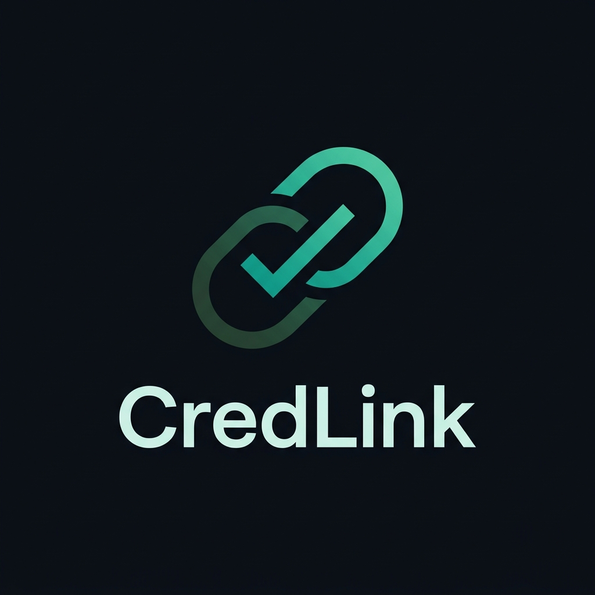

<div align="center">
  
  <h1>CredLink</h1>
  <p><em>Unified Life-Stage Digital Identity & Record Network</em></p>
</div>

**CredLink** is a digital credential infrastructure platform designed to simplify how academic and institutional records are issued, stored, shared, and verified across organizations.

The platform connects trusted issuers, individuals, and verifiers through a consent-driven credential lifecycle, with a focus on interoperability, privacy, and secure verification.

> **Current milestone:** Supabase-backed authentication, institutional authorization, credential lifecycle, consent management, verification, and audit logging.

---

## Overview

Traditional record verification often involves repeated document submissions, manual validation, and fragmented institutional systems.

CredLink aims to reduce this friction through a unified digital credential ecosystem in which:

- **Institutions** issue and manage digital credentials.
- **Individuals** control consent for sharing their records.
- **Verifiers** request and validate credentials for authorized purposes.
- **Network administrators** oversee institutional trust and platform governance.

The project follows a user-centric identity approach, with the long-term goal of supporting standards-based Verifiable Credentials and self-sovereign identity.

---

## Core Features

### Authentication & Role-Based Access
- Authenticated login and role resolution.
- Five institutional and governance contexts.
- Role-specific dashboards and access controls.
- Organization membership validation.
- Backend-enforced authorization and organization isolation.

### Credential Management
- Institution-authorized credential issuance.
- Persistent credential records in Supabase.
- Credential status tracking.
- Credential revocation with recorded reasons and timestamps.
- Validation of issuer authorization and credential types.

### Consent Management
- Verifier-initiated consent requests.
- Citizen-controlled approval and rejection.
- Approved claims and consent timestamps.
- Authorization checks to ensure only the intended citizen can respond.

### Credential Verification
- Backend-driven credential verification.
- Credential status and revocation checks.
- Consent-aware verification workflows.
- Verification outcomes and audit records.

### Institutional Trust Registry
- Institutional registration and trust information.
- Issuer and verifier organization contexts.
- Organization-based authorization.

### Audit Logging
- Credential issuance and revocation events.
- Verification and consent activity.
- Actor and organization attribution.
- Persistent audit records for traceability.

---

## System Architecture

```text
                    CredLink Platform
                           |
             +-------------+-------------+
             |                           |
       Frontend Portal              Backend API
       Next.js / TypeScript         Node.js / Express
             |                           |
             |                      Authentication
             |                      Authorization
             |                      Credential APIs
             |                      Consent APIs
             |                      Verification
             |                      Audit Logging
             |                           |
             +-------------+-------------+
                           |
                       Supabase
                           |
              +------------+------------+
              |                         |
         PostgreSQL                Supabase Auth
         Database                  User Identity
              |
       Institutional Data
       Credentials & Status
       Consents & Audit Logs
       Trust Registry
```

### Technology Stack

| Layer | Technologies |
|---|---|
| Frontend | Next.js, React, TypeScript |
| Styling | Tailwind CSS |
| Backend | Node.js, Express.js, TypeScript |
| Database | PostgreSQL |
| Backend Services | Supabase |
| Authentication | Supabase Auth and backend role resolution |
| API Integration | Shared API client |
| Validation | Zod |
| Testing | TypeScript tests and integration tests |
| Version Control | Git and GitHub |

---

## User Roles

| Role | Responsibility |
|---|---|
| Network Admin | Platform governance and institutional oversight |
| College | Academic credential issuance |
| Hospital | Healthcare institutional context |
| Bank | Financial institutional context |
| Employer | Credential requests and verification |

The current prototype uses synthetic institutional organizations and test accounts for development.

---

## Project Structure

```text
CredLink-2.0/
│
├── backend/
│   ├── migrations/
│   ├── src/
│   ├── tests/
│   ├── package.json
│   └── tsconfig.json
│
├── frontend/
│   ├── apps/
│   │   └── web/
│   │       ├── app/
│   │       ├── components/
│   │       ├── tests/
│   │       └── ...
│   │
│   └── packages/
│       ├── api-client/
│       ├── shared-types/
│       └── validation/
│
├── .gitignore
└── README.md
```

---

## Getting Started

### Prerequisites

Install the following before running the project:

- Node.js
- npm
- pnpm
- Git
- A configured Supabase project

### 1. Clone the Repository

```bash
git clone https://github.com/bhumii-10/CredLink-2.0.git
cd CredLink-2.0
```

### 2. Configure the Backend

Navigate to the backend:

```bash
cd backend
npm install
```

Create a `.env` file using the required variables from `.env.example`.

Configure your Supabase project URL, keys, authentication settings, and any other variables required by the backend.

Build the backend:

```bash
npm run build
```

Start the backend using the development or start script defined in `backend/package.json`.

### 3. Configure the Frontend

From the repository root:

```bash
cd frontend
pnpm install
```

Configure the frontend environment variables using the relevant example configuration.

Set the backend API URL to your local backend address.

Navigate to the web application:

```bash
cd apps/web
```

Build the frontend:

```bash
npm run build
```

Start the application using the available scripts in the frontend package.

> **Note:** Environment variable names and available start/test scripts should be checked in the corresponding `.env.example` and `package.json` files. Never commit real environment secrets.

---

## Credential Lifecycle

The current backend supports the following database-backed workflow:

```text
Institution Login
       |
       v
Organization Authorization
       |
       v
Credential Issuance
       |
       v
Supabase Persistence
       |
       v
Verifier Requests Consent
       |
       v
Citizen Reviews Request
       |
       v
Consent Approval
       |
       v
Credential Verification
       |
       v
Verification Result & Audit Log
```

Credential revocation is also supported. A revoked credential is rejected by the current verification workflow.

---

## Security & Data Principles

CredLink is designed around the following principles:

- **Least privilege:** Access is restricted according to authenticated roles and institutional membership.
- **Organization isolation:** Backend authorization checks organization context rather than trusting client-supplied identifiers.
- **Consent-driven sharing:** Individuals approve requests to share their information.
- **Credential lifecycle tracking:** Issuance, revocation, consent, and verification events are recorded.
- **User-held credentials:** The intended architecture keeps the full usable Verifiable Credential in the citizen's wallet rather than relying on a centralized credential vault.
- **Separation of concerns:** Supabase supports institutional source records, credential metadata and status, consent receipts, audit records, and trust information.

The current prototype uses an application-level HMAC-SHA256 signature for its existing credential workflow. This is **not yet a standards-based W3C Verifiable Credential signature**.

---

## Current Development Status

| Component | Status |
|---|---|
| Authentication and role resolution | Completed |
| Five role contexts | Completed |
| Organization membership authorization | Completed |
| Supabase persistence | Completed |
| Credential issuance and revocation | Completed |
| Consent request and approval | Completed |
| Backend verification workflow | Completed |
| Audit logging | Completed |
| Frontend API integration | Completed |
| Veramo agent integration | In progress |
| DID creation and key management | Planned |
| Standards-based Verifiable Credentials | Planned |
| Citizen-held wallet integration | Planned |
| QR-based credential presentation | Planned |
| Standards-based presentation verification | Planned |

The completed Supabase milestone has been validated through backend and frontend builds and integration tests. The remaining identity and wallet capabilities are part of the next development phase.

---

## Roadmap

- [ ] Integrate Veramo for DID and key management.
- [ ] Implement standards-based Verifiable Credential issuance.
- [ ] Integrate a citizen-controlled credential wallet.
- [ ] Implement QR-based presentation requests.
- [ ] Support secure credential presentation and verification.
- [ ] Connect credential status and revocation with the standards-based verification flow.
- [ ] Improve interoperability across institutional domains.

---

## Contributing

CredLink is being developed collaboratively.

To contribute:

1. Fork or clone the repository.
2. Create a feature branch.
3. Make changes within the relevant frontend or backend module.
4. Run the applicable builds and tests.
5. Submit a pull request with a clear description of the changes.

Coordinate changes to shared types, API contracts, authentication, and database migrations with the team to avoid integration conflicts.

---

## Project Vision

**One trusted digital identity. Records that move with the individual. Sharing that stays under their control.**

CredLink aims to provide an interoperable foundation for trusted digital records across education, healthcare, finance, and employment.

---

**Repository:** [github.com/jaypatil1229/cred-link](https://github.com/jaypatil1229/cred-link)

**Project:** CredLink  
**Category:** Digital Identity · Verifiable Credentials · Digital Public Infrastructure · Identity & Verification
