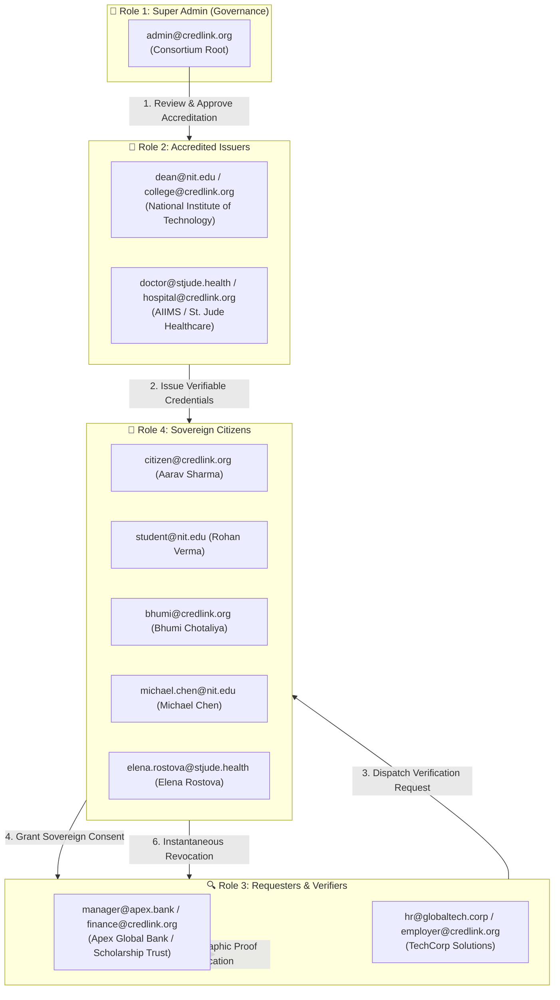

# CredLink 2.0 — System Architecture, Workflow Analysis & Master Credentials Guide

> **🏛️ AUTHORITATIVE SPECIFICATION & TESTING REFERENCE**  
> *This document provides an end-to-end analysis of CredLink 2.0, detailing the project problem statement, system workflow, implementation plan, cryptographic trust model, and the verified authentication credentials for all user personas across the platform.*

---

## 1. Project Analysis & Core Problem Statement

### The Problem
In traditional institutional ecosystems, life-stage records (academic degrees, medical immunizations, employment attestations, financial KYC) remain highly fragmented:
- **Centralized Silos**: Organizations maintain separate, non-interoperable databases.
- **Vulnerability to Forgery**: Paper certificates and PDF scans are easily altered with basic image manipulation.
- **Privacy Intrusion**: Citizens are forced to disclose entire documents containing sensitive personally identifiable information (PII) rather than only the specific claim required.
- **Slow Verification**: Verification processes often require manual back-and-forth phone calls or email checks that take days or weeks.

### The CredLink Solution
**CredLink 2.0** is a citizen-centric, decentralized digital identity and verifiable record network. It establishes a cryptographically secure trust triangle connecting:
1. **Accredited Issuers** (universities, hospitals, corporations) that issue tamper-evident credentials.
2. **Citizens** who hold complete custody of their records in a personal self-custodial digital wallet.
3. **Requesters** (employers, banks, scholarship foundations) that verify disclosed claims instantly without accessing the citizen's broader private identity.
4. **Network Governance** that oversees institutional accreditation and maintains cryptographic trust registries.

---

## 2. Platform Architecture & Workflow Analysis

### The 4 Core User Personas

---

### The 6-Stage Cryptographic Trust Lifecycle

1. **Institutional Accreditation**:
   - An organization registers its public profile, metadata, and intended schema types.
   - The Super Admin reviews the application on `/organizations`, assigns cryptographic DIDs (`did:credlink:org:...`), and unlocks credential issuance tools.
2. **Cryptographic Issuance**:
   - The authorized issuer specifies citizen claims (e.g. GPA, degree name, immunization status) and signs the credential with Veramo/Ed25519 or HMAC-SHA256 signatures.
   - The credential payload is delivered directly to the citizen's digital wallet (`/credentials`).
3. **Multi-Citizen Request Dispatch**:
   - A verifier creates a multi-recipient request on `/verification` (Gmail-style email chip input) requesting specific claims (e.g. "Degree Name + Graduation Year").
4. **Citizen Sovereign Consent**:
   - The citizen receives real-time notification on `/verification`.
   - The citizen reviews the requesting entity, stated purpose, and requested claims.
   - The citizen grants or declines consent. Selective disclosure ensures only approved claims are unlocked.
5. **Tamper-Evident Verification**:
   - Once approved, the requester inspects the disclosed claims.
   - The requester runs live cryptographic verification against the issuer DID and trust registry.
6. **Sovereign Revocation**:
   - At any time, the citizen can click **Revoke Access** on `/verification`.
   - Access to the underlying credential payload is immediately severed at the backend database and API level.

---

## 3. Implementation Plan & Technology Stack

| Layer | Technology | Key Implementation Characteristics |
| :--- | :--- | :--- |
| **Frontend Portal** | Next.js 15 (App Router), React 19, Tailwind CSS | Modular dashboards, Topbar demo persona quick-switcher, responsive layout, PWA support, Lucide icons. |
| **Backend API** | Node.js, Express.js 5 (ESM), TypeScript | REST API architecture, CORS origin enforcement, helmet security headers, Zod validation, Morgan request logging. |
| **Cryptography** | Veramo Core 7.0, `@veramo/did-provider-key`, `@veramo/kms-local` | Persistent issuer identity (`did:key:z6Mkev...`), W3C Verifiable Credential data models, tamper-evident signatures. |
| **Identity & Database**| Supabase (Auth + PostgreSQL) | Auto-confirmed email sessions, least-privilege role assignment, row-level isolation, organization memberships. |

---

## 4. Master Role & Credentials Matrix (100% Verified)

> **💡 Status**: All accounts below are provisioned and verified in Supabase Auth. You can log into any of these accounts via `/login` or using the **Topbar Demo Switcher**.

### 👑 Role 1: Super Admin (Network Governance)
| Full Name | Email Address | Password | Organization / Entity | Core Responsibilities |
| :--- | :--- | :--- | :--- | :--- |
| **Network Administrator** | `admin@credlink.org` | `CredLink@2025` | CredLink Network Governance Authority | Issuer onboarding, accreditation review, system-wide audit logs, consortium master controls |

---

### 🏫 Role 2: Accredited Issuers (Education & Healthcare)
| Full Name | Email Address | Password | Organization / Entity | Core Responsibilities |
| :--- | :--- | :--- | :--- | :--- |
| **Prof. Rajesh Kumar** | `dean@nit.edu` | `Education@2025` | National Institute of Technology (NIT) | Issue Engineering degrees, Grade Cards, and official academic transcripts |
| **Dean of Academic Affairs** | `college@credlink.org` | `Education@2025` | Academic Governance Board | Institutional credential auditing and academic policy accreditation |
| **Dr. Priya Sharma** | `doctor@stjude.health` | `Health@2025` | AIIMS / St. Jude Healthcare System | Issue Immunization Certificates, Vaccine Records, and Medical Clearances |
| **Chief Medical Officer** | `hospital@credlink.org` | `Health@2025` | Healthcare Trust Network | Health protocol governance and hospital accreditation reviews |

---

### 🔍 Role 3: Requesters & Verifiers (Finance, Trust, & Enterprise)
| Full Name | Email Address | Password | Organization / Entity | Core Responsibilities |
| :--- | :--- | :--- | :--- | :--- |
| **Anita Desai** | `manager@apex.bank` | `Finance@2025` | Apex Global Bank / Scholarship Trust | Multi-citizen scholarship verification, loan KYC evaluation, academic standing audits |
| **Chief Financial Officer** | `finance@credlink.org` | `Finance@2025` | Global Finance & Trust Consortium | Financial KYC compliance reviews and cross-border trust validations |
| **Vikram Singh** | `hr@globaltech.corp` | `Employer@2025` | TechCorp Solutions (GlobalTech) | Pre-employment background checks, degree attestations, experience letters |
| **VP of Talent & People** | `employer@credlink.org` | `Employer@2025` | Enterprise Talent Network | Corporate verification governance and organizational HR compliance |

---

### 👤 Role 4: Sovereign Citizens (Digital Wallet Holders)
| Full Name | Email Address | Password | Citizen ID / Reference | Primary Wallet Holdings & Test Utility |
| :--- | :--- | :--- | :--- | :--- |
| **Aarav Sharma** | `citizen@credlink.org` | `Citizen@2025` | `CIT-884920` / `STU-2022-881` | Primary test wallet: Bachelor of Science, Employment Record, Immunization Record, KYC |
| **Rohan Verma** | `student@nit.edu` | `Citizen@2025` | `STU-2022-881` | Secondary student wallet: Grade Card final semester, multi-recipient dispatch testing |
| **Bhumi Chotaliya** | `bhumi@credlink.org` | `Citizen@2025` | `CIT-992014` | Primary QA wallet: Employment verification, active third-party authorization tests |
| **Michael Chen** | `michael.chen@nit.edu` | `Citizen@2025` | `STU-2023-104` | Academic citizen wallet: Academic Transcript Attestation (`vc_edu_202`) |
| **Elena Rostova** | `elena.rostova@stjude.health` | `Citizen@2025` | `CIT-771239` | Healthcare citizen wallet: Health Insurance Eligibility Attestation (`vc_hosp_102`) |

---

## 5. Verifiable Credential Catalog

| Credential ID | Credential Title | Issuing Authority | Subject Citizen | Certified Claims |
| :--- | :--- | :--- | :--- | :--- |
| `vc_edu_201` | **Bachelor of Science in Computer Engineering** | National Institute of Technology (`dean@nit.edu`) | Aarav Sharma (`citizen@credlink.org`) | Degree Name, Cumulative GPA (3.92 / 4.00), Graduation Year (2025), Magna Cum Laude |
| `vc_edu_202` | **Academic Transcript Attestation** | National Institute of Technology (`dean@nit.edu`) | Michael Chen (`michael.chen@nit.edu`) | Major (Data Science), Completed Credits (128 ECTS), Transcript SHA-256 Digest |
| `vc_edu_203` | **Grade Card & Academic Attestation** | National Institute of Technology (`dean@nit.edu`) | Rohan Verma (`student@nit.edu`) | Final Term SGPA (9.42 / 10.0), CGPA (9.18), Distinction Honors |
| `vc_hosp_101` | **Immunization & Vaccine Record** | AIIMS / St. Jude (`doctor@stjude.health`) | Aarav Sharma (`citizen@credlink.org`) | Hepatitis B Booster, MMR Vaccine, Batch ID, Clinician License, Active Immunity |
| `vc_hosp_102` | **Health Insurance Eligibility** | AIIMS / St. Jude (`doctor@stjude.health`) | Elena Rostova (`elena.rostova@stjude.health`) | Policy Tier (Comprehensive Care), Coverage Status (ACTIVE), Emergency Code |
| `vc_emp_401` | **Employment Verification Record** | TechCorp Solutions (`hr@globaltech.corp`) | Aarav Sharma (`citizen@credlink.org`) | Role (Senior Software Architect), Department (Cloud Infra), Status (Permanent Full-time) |
| `vc_emp_402` | **Official Work Experience Letter** | TechCorp Solutions (`hr@globaltech.corp`) | Aarav Sharma (`citizen@credlink.org`) | Role (Lead Full Stack Engineer), Duration (3 Years), Relieving Clearance Issued |

---

## 6. End-to-End Workflow Testing Guide

### Flow 1: Super Admin Approves Institutional Issuer
1. Open [http://localhost:3000/login](http://localhost:3000/login) and sign in as **Super Admin**:
   - **Email**: `admin@credlink.org`
   - **Password**: `CredLink@2025`
2. Navigate to **Issuers & Approvals** (`/organizations`).
3. Click the **Pending Review** tab to see pending applicant organizations (e.g. *St. Xavier Institute of Technology*).
4. Click **Approve**. The organization status transitions to `APPROVED`, and authorized credential schemas are assigned.

### Flow 2: College Issues Credential to Citizen Wallet
1. Switch to **College Issuer**:
   - **Email**: `dean@nit.edu`
   - **Password**: `Education@2025`
2. Navigate to **Issue & Manage Credentials** (`/credentials`).
3. Click **Issue Certificate to Citizen**.
4. Select citizen **Aarav Sharma (`citizen@credlink.org`)**, choose **Degree Certificate**, enter academic attributes, and click **Sign & Issue**.
5. The issued credential is cryptographically signed and immediately arrives in the citizen's wallet.

### Flow 3: Bank Dispatches Multi-Recipient Request (Gmail-style)
1. Switch to **Requester / Bank**:
   - **Email**: `manager@apex.bank`
   - **Password**: `Finance@2025`
2. Navigate to **Request & Verify Documents** (`/verification`).
3. Click **Request Documents (Multi-Citizen)**.
4. Add recipients: `citizen@credlink.org` and `student@nit.edu`.
5. Select document types: **Academic Degree Certificate** and **Grade Card / Transcript**.
6. Set purpose: *"Scholarship Award Eligibility Verification 2026"*.
7. Click **Dispatch Requests**. Verification requests are sent simultaneously in batch.

### Flow 4: Citizen Grants Consent & Revokes Access
1. Switch to **Citizen**:
   - **Email**: `citizen@credlink.org`
   - **Password**: `Citizen@2025`
2. Open **Consent & Requests** (`/verification`).
3. Under **Incoming Document Requests**, find the request from **Apex Global Bank**.
4. Click **Approve** to unlock verified disclosure for the requester.
5. In **Active Third-Party Authorizations**, verify the active grant. Click **Revoke Access** to test sovereign revocation—access is instantaneously severed!

### Flow 5: Requester Inspects Verified Document & Cryptographic Proof
1. Switch back to **Requester / Bank**:
   - **Email**: `manager@apex.bank`
   - **Password**: `Finance@2025`
2. On `/verification`, inspect the approved request.
3. Click **View Documents** to inspect disclosed claims and click **Re-Verify Cryptographic Signature** to confirm cryptographic integrity against the issuer DID.
