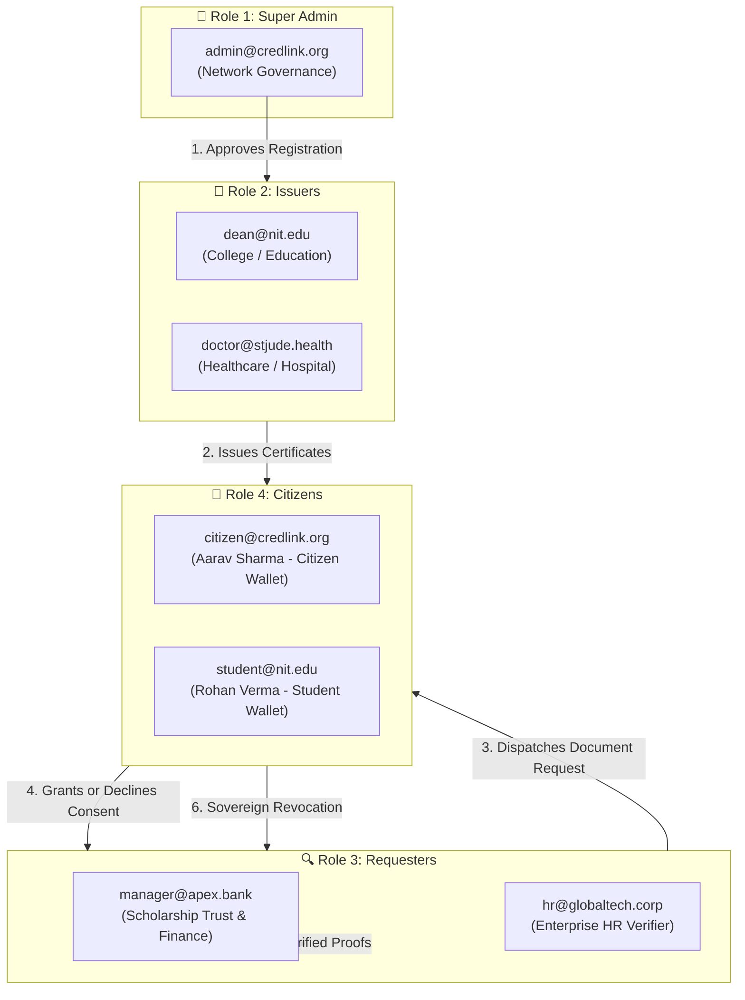

# CredLink — Master User Roles & Credentials Reference Guide

> **⚠️ CONFIDENTIAL & LOCAL TESTING REFERENCE**  
> This document categorizes all **User Roles** and **Verifiable Credentials** across the 4 core platform personas for end-to-end workflow testing.

---

## 🏛️ System Overview: The 4 User Roles

CredLink operates on a decentralized trust architecture with 4 distinct personas:

---

## 📋 Role & Test Account Master Table

| Role # | Role Name | Test Email | Password | Organization / Entity | Core Responsibilities |
| :--- | :--- | :--- | :--- | :--- | :--- |
| **Role 1** | **Super Admin** | `admin@credlink.org` | `CredLink@2025` | CredLink Network Governance Authority | Approve/reject issuer organizations, view system audit ledger, universal issuance/request override |
| **Role 2a** | **Issuer (Education)** | `dean@nit.edu` | `Education@2025` | National Institute of Technology (NIT) | Issue Bachelor of Science degrees, Grade Cards, and transcripts to citizens |
| **Role 2b** | **Issuer (Healthcare)**| `doctor@stjude.health` | `Health@2025` | All India Institute of Medical Sciences (AIIMS) | Issue Immunization Certificates, Vaccine Records, and Health Attestations |
| **Role 3a** | **Requester (Trust)** | `manager@apex.bank` | `Finance@2025` | Apex Global Bank / Scholarship Trust | Dispatch multi-recipient email requests to citizens, evaluate scholarships, verify KYC |
| **Role 3b** | **Requester (Employer)**| `hr@globaltech.corp` | `Employer@2025` | TechCorp Solutions | Request pre-employment background checks, degree & experience attestations |
| **Role 4a** | **Citizen (Primary)** | `citizen@credlink.org` | `Citizen@2025` | Aarav Sharma (Self-Custodial Wallet) | Store credentials in wallet, present QR, review incoming requests, grant/decline, revoke access |
| **Role 4b** | **Citizen (Student)** | `student@nit.edu` | `Citizen@2025` | Rohan Verma (Student Wallet) | Store academic credentials, receive scholarship requests, test multi-recipient dispatch |

---

## 🗂️ Credential Categorization by User Role

### 1. 👑 Super Admin / Network Governance Credentials
*These credentials represent root authority, accreditation standards, and cryptographic trust policies.*

| Credential ID | Credential Title | Schema Type | Issuing Authority | Purpose |
| :--- | :--- | :--- | :--- | :--- |
| `vc_admin_001` | **Network Governance Root Attestation** | `NetworkGovernanceAttestation` | CredLink Network Governance (`did:credlink:gov:root`) | Establishes root consensus and trust registry policies across consortium |
| `vc_admin_002` | **Issuer Accreditation Certificate** | `AccreditationCredential` | CredLink Authority | Authorizes an organization (e.g. NIT, AIIMS) to issue cryptographically signed credentials |

---

### 2. 🏫 Issuer Issued Documents & Certificates
*These credentials are cryptographically issued by accredited institutions and delivered directly to citizen wallets.*

#### A. Education Realm (National Institute of Technology — `dean@nit.edu`)
| Credential ID | Credential Title | Subject (Citizen) | Claims Certified |
| :--- | :--- | :--- | :--- |
| `vc_edu_201` | **Bachelor of Science in Computer Engineering** | Aarav Sharma (`STU-2022-881`) | Degree Name, Cumulative GPA (3.92 / 4.00), Graduation Year (2025), Honors (Magna Cum Laude) |
| `vc_edu_202` | **Academic Transcript Attestation** | Michael Chen (`STU-2023-104`) | Credits (128 ECTS), Major (Data Science), Transcript SHA-256 Digest |
| `vc_edu_203` | **Grade Card & Academic Attestation** | Rohan Verma (`STU-2022-881`) | Semester 8 Final Term, SGPA (9.42 / 10.0), CGPA (9.18), Distinction Honors |

#### B. Healthcare Realm (AIIMS / St. Jude — `doctor@stjude.health`)
| Credential ID | Credential Title | Subject (Citizen) | Claims Certified |
| :--- | :--- | :--- | :--- |
| `vc_hosp_101` | **Immunization & Vaccine Record** | Aarav Sharma (`CIT-884920`) | Vaccine Type (Hepatitis B Booster & MMR), Dose Batch ID, Clinician License, Immunity Active |
| `vc_hosp_102` | **Health Insurance Eligibility** | Elena Rostova (`CIT-771239`) | Policy Tier (Comprehensive Premium Care), Coverage Status (ACTIVE), Emergency Code |

#### C. Employment Realm (TechCorp Solutions — `hr@globaltech.corp`)
| Credential ID | Credential Title | Subject (Citizen) | Claims Certified |
| :--- | :--- | :--- | :--- |
| `vc_emp_401` | **Employment Verification Record** | Aarav Sharma (`EMP-9022`) | Role (Senior Software Architect), Department (Cloud Infra), Status (Full-time Permanent), Start Date |
| `vc_emp_402` | **Official Work Experience Letter** | Aarav Sharma (`CIT-884920`) | Role (Lead Full Stack Engineer), Service Duration (3 Years), Rating (Top 5%), Relieving Clearance |

---

### 3. 🔍 Requester Verified Documents & Consent Claims
*These records represent claims requested by third-party verifiers (trusts, employers, banks) and unlocked with citizen consent.*

| Request ID | Requester Entity | Target Citizen(s) | Requested Documents / Claims | Status |
| :--- | :--- | :--- | :--- | :--- |
| `vr_req_801` | **Apex Imperial Bank** | Aarav Sharma (`citizen@credlink.org`) | Degree Name, Graduation Year, Current Role, Employment Status | **APPROVED** (Disclosed & Verified with Ed25519 signature) |
| `vr_req_802` | **Apex Scholarship Foundation** | Rohan Verma (`student@nit.edu`) | Grade Card, CGPA Attestation, Academic Standing | **PENDING** (Awaiting Rohan Verma's consent decision) |
| `vr_req_803` | **GlobalTech HR** | Aarav Sharma (`citizen@credlink.org`) | Comprehensive Background Check & Medical Fit Attestation | **DENIED** (Declined by Citizen — sovereign privacy maintained) |
| `vr_req_804` | **Venture Loan Trust** | Aarav Sharma (`citizen@credlink.org`) | Income Attestation & Bank Standing | **REVOKED** (Previously approved, citizen later revoked authorization) |

---

### 4. 👤 Citizen Digital Wallet Holdings
*These credentials are stored in the citizen's personal self-custodial vault, ready for selective presentation or verification.*

#### A. Aarav Sharma (`citizen@credlink.org` / `Citizen@2025`)
- `vc_edu_201`: Bachelor of Science Degree (NIT)
- `vc_emp_401`: Employment Verification (GlobalTech)
- `vc_emp_402`: Work Experience Letter (TechCorp Solutions)
- `vc_hosp_101`: Immunization Record (AIIMS / St. Jude)
- `vc_bank_301`: KYC & Identity Attestation (Apex Bank)

#### B. Rohan Verma (`student@nit.edu` / `Citizen@2025`)
- `vc_edu_203`: Grade Card & Academic Attestation (NIT)
- `vc_edu_202`: Academic Transcript Attestation (NIT)

---

## 🧪 Step-by-Step Testing Walkthrough

Follow this sequence to test the complete application lifecycle:

### Flow 1: Super Admin Approves a New Issuer
1. Go to `http://localhost:3000/login` and log in as Super Admin (`admin@credlink.org` / `CredLink@2025`).
2. Navigate to **Issuers & Approvals** (`/organizations`).
3. Click the **Pending Review** tab. Notice the application for **"St. Xavier Institute of Technology"**.
4. Click **Approve**. The status immediately updates to **APPROVED**, and authorized credential schemas are assigned.
5. Alternatively, click **Register New Issuer Organization** to submit an application and approve it.

### Flow 2: Issuer Issues Certificate to Citizen
1. Switch to College Issuer (`dean@nit.edu` / `Education@2025`).
2. Navigate to **Issue & Manage Credentials** (`/credentials`).
3. Click **Issue Certificate to Citizen**.
4. Select citizen **Aarav Sharma (`citizen@credlink.org`)**, choose **Degree Certificate**, enter GPA/major, and click **Sign & Issue**.
5. Notice the new credential appears in the registry with cryptographic signature and IPFS hash.

### Flow 3: Requester Dispatches Multi-Recipient Request (Gmail-style)
1. Switch to Requester (`manager@apex.bank` / `Finance@2025`).
2. Navigate to **Request & Verify Documents** (`/verification`).
3. Click **Request Documents (Multi-Citizen)**.
4. In the email composer, type `citizen@credlink.org` and press <kbd>Enter</kbd>. Then click the suggestion `+ Rohan Verma (student@nit.edu)`.
5. Select **Academic Degree Certificate** and **Grade Card / Transcript**.
6. Set purpose to *"Scholarship Award Eligibility Verification"*, and click **Dispatch Requests**.
7. Both requests are dispatched simultaneously via the backend batch endpoint.

### Flow 4: Citizen Reviews, Approves & Revokes Consent
1. Switch to Citizen (`citizen@credlink.org` / `Citizen@2025`).
2. Navigate to **Citizen Digital Wallet** (`/credentials`) or **Consent & Requests** (`/verification`).
3. Notice the **Incoming Document Requests** banner showing the request from **Apex Global Bank**.
4. Click **Approve** to grant disclosure, or **Decline** to reject.
5. In the **Active Third-Party Authorizations** table, view the granted access and click **Revoke Access** to immediately terminate the requester's viewing rights!

### Flow 5: Requester Views Verified Documents
1. Switch back to Requester (`manager@apex.bank` / `Finance@2025`).
2. On `/verification`, notice the request now shows status **APPROVED**.
3. Click **View Documents**. Inspect the disclosed claims, issuer DID, and click **Re-Verify Cryptographic Signature** to run live verification!
