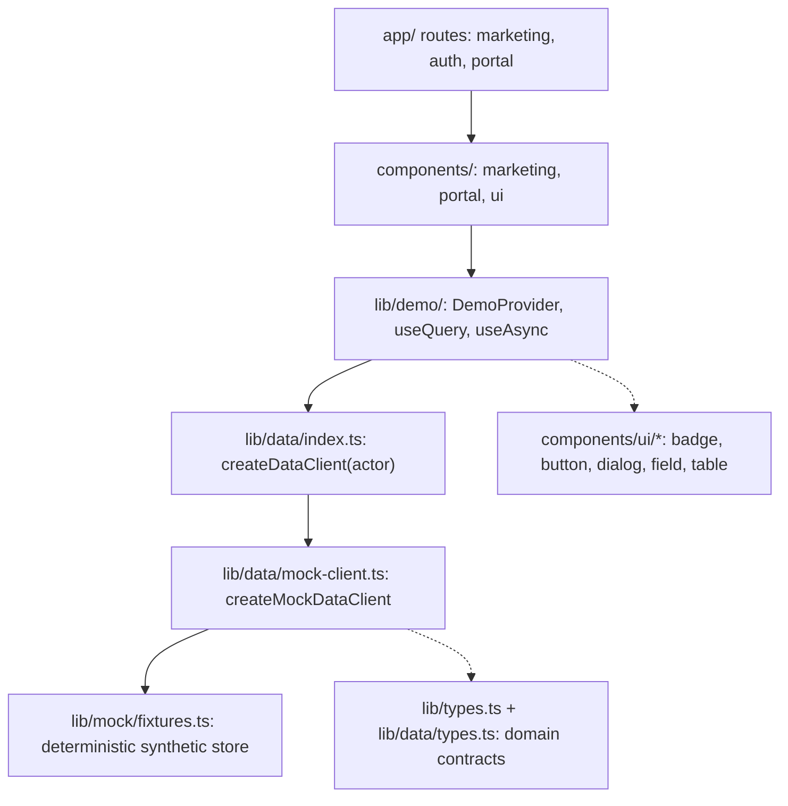

# CredLink Frontend V2 — Integration Readiness Audit & Technical Handoff

**Document type:** Read-only integration audit + new-session handoff
**Audience:** A fresh AI coding agent (or engineer) with no access to the previous conversation
**Date of audit:** 2026-10-03
**Scope:** `frontend-v2/` (Next.js app) and `backend/` (Express + Supabase + Veramo API), plus `frontend-v2/docs/FRONTEND_RECONNAISSANCE.md`, `frontend-v2/docs/DESIGN.md`, and the design references in `frontend-v2/docs/design/`
**Nature of the work performed:** Inspection and documentation only. No source file, configuration file, schema, migration, dependency, or existing document was modified. This file is the only artifact created.

**Evidence labels used throughout**

- **Verified** — confirmed directly in source code, schema, or a command that was actually run.
- **Partially verified** — some evidence exists, but one or more parts could not be confirmed in this pass.
- **Inferred** — a reasoned conclusion not directly established by source.
- **Not implemented** — the functionality is absent from the inspected code.
- **Blocked** — could not be verified because of missing credentials, running services, or infrastructure.

Every material claim below cites the file or command it comes from. Where something was not checked, this document says so instead of guessing.

---

## 1. Executive summary

**1. Is Frontend V2 structurally ready for backend integration?**
Yes, structurally. The app has a single documented swap point (`lib/data/index.ts`), a `DataClient` interface that already models the real backend's vocabulary, an `ApiResponse<T>` envelope that matches the backend's actual success/error shape, and no hard-coded fetch calls scattered through components. There is nothing to untangle: integration is a matter of writing one real client behind a stable interface and wiring authentication. **Verified.**

**2. Which areas are already compatible?**
- Response envelope shape (`success / message / data / error / details / timestamp`) — frontend `lib/types.ts` `ApiResponse<T>` matches `backend/src/middleware/errorHandler.ts` and every controller. **Verified.**
- Domain vocabularies (roles, credential domains, consent statuses, trust statuses) — frontend unions match the database CHECK constraints and the backend Zod enums. **Verified.**
- Consent decisions (`{ action: 'APPROVE' | 'DENY', approvedClaims?, expiresAt? }`) — frontend and `backend/src/validators/consent.validator.ts` agree. **Verified.**
- Consent expiry uses `expiresAt` (ISO datetime) on both sides — the old `expiresInDays` mismatch is no longer present in either codebase. **Verified.**
- Login/me `user` object fields (`fullName`, `organizationId`, `organizationName`, `organizationCode`, `organizationDomain`, `organizationDid`, `organizationStatus`, `isIssuer`, `authorizedCredentialTypes`) match the frontend `AuthUserRecord` field-for-field. **Verified.**
- The marketing site is fully static and self-hosted — no network dependency at all, so it cannot be destabilised by integration work. **Verified.**

**3. Which areas require adapters or contract corrections?**
- **No API base URL exists.** There is not a single `process.env` or `NEXT_PUBLIC_*` reference anywhere in `frontend-v2/`. **Verified by exhaustive grep.** The app cannot reach any backend today.
- **CORS does not allow the V2 dev origin.** `backend/src/app.ts` allow-lists `FRONTEND_URL`, `http://localhost:3000`, `http://localhost:5000`, `http://127.0.0.1:3000`, `http://127.0.0.1:5000`. Frontend V2 runs on **port 3200**. Live calls from V2 would be blocked by CORS as configured. **Verified.**
- **Credential issuance payload mismatch.** Backend `createCredentialSchema` requires `subjectId`, `issuerOrgId`, `domain`, `credentialType`, `title`, `claims` and accepts `expirationDate`; it is `.strict()`, so unknown keys are rejected. Frontend `IssueCredentialInput` sends `expiresAt` and does **not** send `issuerOrgId`. **Verified** — this will return 400.
- **Consent request payload mismatch.** Backend `requestConsentSchema` requires `requestingOrgId`; frontend `RequestConsentInput` omits it. **Verified.**
- **Shared-access payload mismatch.** Backend `shareCredentialSchema` requires `credentialId` **and** `requestingOrgId`; frontend `accessSharedCredential` sends only `credentialId`. **Verified.**
- **`search` query parameters are not supported** by the backend list endpoints (credentials, consents, audit, trust) — the frontend query objects include `search`. The mock already filters client-side for audit (finding F-12). **Verified.**
- **Two verification endpoints exist** (`POST /api/credentials/verify` and `POST /api/verification/verify-credential`) with different request schemas. The frontend models a third shape (`VerifyInput`). A mapping decision is required. **Partially verified** — the exact schema of `comprehensiveVerifySchema` was not read in this pass; it lives in `backend/src/validators/trust.validator.ts`.
- **Register response has no `assignedRole` / `roleDowngraded`.** The backend silently forces `ADMIN` to `CITIZEN` in `authService.registerUser`; the frontend's `RegisterResult` expects those fields to be returned, so the adapter must compute them. **Verified.**

**4. Which areas are blocked by missing backend functionality?**
- `GET /api/demo/dashboard` is **broken** — it queries `.from('consent_requests')`, a table that does not exist (migration `001_initial_schema_and_rls.sql` creates `consents`). **Verified.** Do not build on this endpoint.
- There is **no passwordless flow**, no email verification, and no password reset. **Verified.**
- There is **no wallet / citizen-held key** model: credentials live server-side. **Verified.**
- There is **no QR scanning or QR presentation** endpoint; a `qr_payload` column is stored but nothing consumes it through the API. **Verified.**
- `requireRole` middleware exists (`backend/src/middleware/roleMiddleware.ts`) but is **not mounted on any route** — no route file imports it. **Verified.** Authorization currently lives in service-layer checks and RLS.

**5. Most consequential integration risks.**
1. CORS plus a missing base URL will block the very first call. Both are trivial fixes, and both are required before anything works.
2. Request-schema mismatches on issuance, consent request, and shared access are silent traps: they look interface-compatible at the type level because the frontend types were written from a documented contract, not from the validator source.
3. The frontend has no authentication or session implementation at all (`session: null`, `mode: 'demo'` in the types). Integration must add token storage, refresh, and route protection; nothing exists to reuse.
4. The backend resolves a **single active membership** (`.maybeSingle()`). The frontend user model also assumes one active organization, so they agree today — but multi-organization users are silently reduced to one context.
5. RLS is enabled on every table while the backend mostly uses the **service-role key**, which bypasses RLS. Tenant isolation therefore depends on service-layer code, not on database policy. Treat RLS as defence in depth, not as the enforcement point.

**6. What should be addressed before the first live API connection.**
- Publish a written contract for the three mismatched request payloads and choose one verification endpoint.
- Add V2's origin to the backend CORS allow-list, or make the list env-driven.
- Decide and document the authentication model: where the token lives, how refresh works, how expiry is handled, and how server components obtain identity.
- Add an API base URL environment variable to V2.

**7. What can safely be integrated incrementally?**
Marketing pages are static and need nothing. After the four prerequisites above, the safe order is: health → sign-in → `/auth/me` → role and organization context → credential listing → credential detail → consent list and decision → verification → issuance → revocation → trust registry → audit. See §7.

**Readiness classification: READY FOR INCREMENTAL INTEGRATION, WITH PREREQUISITES.**
The UI layer is ready. The contract layer is not: three request payloads and one verification schema must be reconciled first.

---

## 2. How this audit was performed

| Step | Method | Result |
|---|---|---|
| Frontend structure | `Get-ChildItem -Recurse` excluding `node_modules`, `.next`, `.npm-cache` | Complete file inventory (§3.5) |
| Frontend intent | Read `package.json`, `lib/data/index.ts`, `lib/data/types.ts`, `lib/types.ts`, `components/portal/nav.ts`, `app/(portal)/layout.tsx` | Verified |
| Env usage | Grep for `process.env` / `NEXT_PUBLIC` across `*.ts,*.tsx,*.mjs,*.json`, excluding `node_modules`, `.next`, `.npm-cache`, `package-lock.json` | **Zero matches** — Verified |
| Backend structure | `Get-ChildItem -Recurse` excluding build artifacts | Complete inventory (§4) |
| Backend routes | Read every file in `backend/src/routes/` | Verified |
| Backend middleware | Read `authMiddleware.ts`, `roleMiddleware.ts`, `errorHandler.ts` | Verified |
| Backend validators | Read `auth.validator.ts`, `credential.validator.ts`, `consent.validator.ts`, `config/env.ts` | Verified |
| Backend auth flow | Read `auth.controller.ts` and `auth.service.ts` | Verified |
| Backend consent flow | Read `consent.controller.ts` in full | Verified |
| Backend verification | Read `trust.controller.ts` in full; grepped `trust.service.ts` for the verification branches | **Partially verified** — the report's branches were read, but not the whole function |
| Database | Grepped `backend/migrations/*.sql` for tables, policies, and RLS enablement | Verified |
| CORS | Read `backend/src/app.ts` | Verified |
| Demo endpoints | Read `backend/src/routes/demo.routes.ts` | Verified |
| Type checking | **Not run.** `tsc` writes `tsconfig.tsbuildinfo`, which would violate the read-only constraint | Not executed |
| Backend tests | **Not executed.** They require live Supabase credentials and would mutate data | Not executed |
| Live API calls | **Not executed.** No backend with credentials was confirmed running | Blocked |

**Limitation statement.** This audit did not execute the backend, did not connect to Supabase, and did not exercise any endpoint. All backend conclusions are static source-code conclusions. `comprehensiveVerifySchema`, `organization.validator.ts`, `trust.validator.ts`, and the full `verifyCredentialComprehensive` service function were not read line-by-line; they are flagged as partially verified wherever they matter.

---## 3. Frontend V2 — complete technical handoff

### 3.1 What CredLink is

CredLink is a consent-driven credential network. Institutions (colleges, employers, banks, hospitals) issue verifiable records to individuals. Individuals hold those records, choose claim by claim what to release, and approve or deny requests. Verifiers independently check a record's signature, trust status, and lifecycle instead of trusting a copy.

Four parties exist in the model: the **issuer**, the **holder (citizen)**, the **verifier**, and the **network administrator** who governs the trust registry and approves institutions.

**User roles** (verified against `backend/src/validators/auth.validator.ts`): `CITIZEN`, `COLLEGE`, `BANK`, `HOSPITAL`, `EMPLOYER`, `ADMIN`.

**Primary journey:** institution issues → citizen holds → institution requests consent → citizen approves selected claims → verifier checks → audit records the outcome.

### 3.2 Verified product capabilities vs. frontend demonstration

**Verified in the backend (source evidence):**
- Supabase-backed authentication with bearer JWTs and a `profiles` row per user (`middleware/authMiddleware.ts`, `services/auth.service.ts`).
- Credential issuance and W3C JWT signing through Veramo (`backend/src/veramo/issuer.ts`, `@veramo/credential-jwt`).
- Comprehensive verification: signature, trust registry, accreditation domain, lifecycle and expiry, optional consent consumption (`trust.service.verifyCredentialComprehensive`).
- Consent request, approve/deny, revoke, and selective disclosure through `POST /api/consents/share-access`.
- Revocation with a reason (`POST /api/credentials/:id/revoke`).
- Trust registry registration and status changes, network-admin scoped.
- Audit log listing.
- Health check.

**Frontend demonstration only (synthetic, no backend):**
- Every marketing page and every portal screen. All portal data comes from `lib/data/mock-client.ts` over the fixtures in `lib/mock/fixtures.ts`.
- The hero "live preview" credential, the lifecycle scene, the consent demo, and the verification checklist are deterministic UI demonstrations, not API calls.
- Login and registration are **simulated**: `SignInResult.session` is typed as `null` and `mode: 'demo'`.

**Explicitly not real, and not to be presented as real:** wallet or offline possession, QR presentation or scanning, zero-knowledge proofs, MFA, email verification, password reset, notification or webhook delivery, and audit-log immutability.

### 3.3 Architecture

| Concern | Choice | Evidence |
|---|---|---|
| Framework | Next.js 15.5.26, App Router, React 19.3.0 | `frontend-v2/package.json` |
| Language | TypeScript 5.9.3, strict mode | `frontend-v2/tsconfig.json` |
| Rendering | Server components by default; `'use client'` only where motion or interaction requires it | `app/**/page.tsx`, `components/marketing/*` |
| Styling | Tailwind CSS 3.4.19 over a bespoke token layer; CSS custom properties in `app/globals.css` | `tailwind.config.ts`, `app/globals.css` |
| Animation | framer-motion 12.43.0 only (no GSAP) | `package.json`, `docs/resurrection/MOTION_SYSTEM.md` |
| Icons | lucide-react 0.475.0 | `package.json` |
| Class composition | `clsx` + `tailwind-merge` wrapped in `lib/utils.ts` `cn()` | `lib/utils.ts` |
| State | React context and hooks in `lib/demo/`; no Redux, Zustand, or React Query | `lib/demo/*` |
| Data access | `DataClient` interface; `createDataClient()` returns the mock | `lib/data/index.ts`, `lib/data/types.ts` |
| Forms | Plain React controlled/uncontrolled forms with local validation; no form library | `app/login/page.tsx`, `app/register/page.tsx` |
| Auth | **Not implemented.** No token storage, no refresh, no route protection | Verified by grep and by `lib/data/types.ts` comments |
| Tests | **No test framework configured** | `frontend-v2/package.json` |



The intended integration seam is `createDataClient()` in `lib/data/index.ts`. Its doc comment states the plan explicitly: replace the body with a fetch-based implementation of the same `DataClient` interface, constructed with the caller's bearer token instead of a demo actor, and nothing else changes. **Verified.**

### 3.4 Data-layer contract (the integration seam)

`DataClient` (in `lib/data/types.ts`) declares the operations a live client must implement:

```ts
signIn, register, getMe,
listCredentials, getCredential, issueCredential, revokeCredential,
listConsents, getConsent, requestConsent, respondConsent, revokeConsent,
accessSharedCredential, verifyCredential,
listOrganizations, getOrganization, createOrganization, updateOrganizationStatus,
listTrustRegistry, getTrustEntry, registerTrustIssuer, updateTrustStatus,
listCitizens, getProfile, updateProfile, listAuditLogs, checkHealth
```

Supporting contracts already modelled: `ActorContext`, `SignInInput/Result`, `RegisterInput/Result`, `PagedResult<T>`, `CredentialQuery`, `ConsentQuery`, `OrganizationQuery`, `TrustQuery`, `AuditQuery`, `IssueCredentialInput`, `RequestConsentInput`, `ConsentDecisionInput`, `VerifyInput`, `CreateOrganizationInput`. **Verified.**

`lib/data/index.ts` also re-exports `TransportError` and `CREDENTIAL_DOMAIN_BY_ORG_DOMAIN` from the mock client, plus `demoAccounts as previewAccounts`, `DemoAccountSeed`, and `DEMO_NOW`. Anything importing from `@/lib/data` rather than `@/lib/mock/*` is already written against the seam.

### 3.5 Directory and file map

**Routes**

| Path | File | Purpose | Type | Changes during integration? |
|---|---|---|---|---|
| `/` | `app/(marketing)/page.tsx` | Landing narrative: hero → records → lifecycle → consent → evidence → invitation | Presentation | No |
| `/how-it-works` | `app/(marketing)/how-it-works/page.tsx` | Four-move explainer, role permissions, "what actually travels", scope limits | Presentation | No |
| `/trust` | `app/(marketing)/trust/page.tsx` | Check ordering, claims vs. non-claims, known backend gaps register | Presentation | No |
| `/demo` | `app/(marketing)/demo/page.tsx` | Role and context picker that opens the portal as a synthetic actor | Presentation + mock | Yes (becomes real sign-in, or stays as a preview mode) |
| `/login` | `app/login/page.tsx` | Sign-in form (simulated) | Presentation + mock | **Yes — full rework** |
| `/register` | `app/register/page.tsx` | Registration form (simulated, demonstrates the role downgrade) | Presentation + mock | **Yes — full rework** |
| `/portal` | `app/(portal)/portal/page.tsx` | Role-aware overview: attention, recent activity, next actions | Presentation + mock | Yes (data source) |
| `/portal/credentials` | `.../credentials/page.tsx` | Credential list, filterable by role | Presentation + mock | Yes (data source) |
| `/portal/credentials/new` | `.../credentials/new/page.tsx` | Issuance form | Presentation + mock | Yes (payload and data source) |
| `/portal/credentials/[id]` | `.../credentials/[id]/page.tsx` | Credential detail including revocation | Presentation + mock | Yes |
| `/portal/verification` | `.../verification/page.tsx` | Verification requests and results | Presentation + mock | Yes |
| `/portal/verification/new` | `.../verification/new/page.tsx` | Start a verification | Presentation + mock | Yes |
| `/portal/verification/[id]` | `.../verification/[id]/page.tsx` | Verification result detail | Presentation + mock | Yes |
| `/portal/issuers`, `/portal/issuers/[id]` | `.../issuers/*` | Trusted issuer directory and detail | Presentation + mock | Yes |
| `/portal/trust-registry` | `.../trust-registry/page.tsx` | ADMIN-only trust status management | Presentation + mock | Yes |
| `/portal/organizations` | `.../organizations/page.tsx` | ADMIN-only institution approval | Presentation + mock | Yes |
| `/portal/audit` | `.../audit/page.tsx` | Audit trail with client-side search | Presentation + mock | Yes |
| `/portal/profile` | `.../profile/page.tsx` | Profile read and update | Presentation + mock | Yes |

**Key non-route files**

| File | Responsibility | Notes |
|---|---|---|
| `app/layout.tsx` | Root metadata, fonts, `MotionConfig reducedMotion="user"`, noscript reveal fallback | Verified |
| `app/globals.css` | Design tokens as CSS custom properties, type utilities, focus ring, base resets | Source of truth for colour and type |
| `tailwind.config.ts` | Maps CSS variables to Tailwind colour names, radii, container widths | Verified |
| `lib/utils.ts` | `cn()` with an extended tailwind-merge class group so custom `text-*` sizes are not treated as colours | Carries a deliberate fix |
| `lib/types.ts` | Domain vocabularies and records mirroring DB CHECK constraints and verified response shapes | Must stay aligned with §5.4 |
| `lib/data/types.ts` | `DataClient` interface plus actor, session, and query types | The integration contract |
| `lib/data/mock-client.ts` | In-memory implementation (1155 lines) that deliberately preserves known contract mismatches | Reference implementation; defines `TransportError` |
| `lib/mock/fixtures.ts` | Deterministic synthetic entities (716 lines) plus `DEMO_NOW` | Integration replaces this |
| `lib/demo/demo-provider.tsx` | Actor context provider | Integration extends it for a real session |
| `lib/demo/use-async.ts`, `use-query.ts` | Loading, error, and data hooks used by portal screens | Reusable after integration |
| `lib/claims.ts` | Claim vocabulary and label helpers | Presentation |
| `lib/format.ts` | Date and identifier formatting | Presentation |
| `lib/landing-content.ts` | All landing copy in one module | Presentation |
| `components/marketing/*` | Landing acts, header, footer, shells, primitives, credential artifact | Presentation |
| `components/portal/*` | `portal-shell`, `nav.ts`, `list-row`, `table`, `parts` | `nav.ts` owns role gating |
| `components/ui/*` | `badge`, `button`, `copyable-id`, `dialog`, `domain`, `field`, `logo`, `reveal`, `surface`, `toast` | Shared primitives |
| `docs/FRONTEND_RECONNAISSANCE.md` | The authoritative reconnaissance | Do not modify |
| `docs/DESIGN.md`, `docs/design/*.md` | Brand and design specification plus reference studies | Do not modify |
| `docs/resurrection/*` | V2 creative direction, motion system, reference captures, QA screenshots | Reference material |
| `public/fonts/*` | Self-hosted Onest, Newsreader, IBM Plex Mono plus licences | No external fetch |

---### 3.6 Design system (what and why)

**Identity.** The V2 creative direction is "The Trustline": one credential artifact stays visually constant while its meaning changes, travelling a continuous path from issuer to holder to consent to verifier. The signature elements are the interlocking-C mark in `components/ui/logo.tsx` and the connected-path diagrams used across the landing page.

**Colour.** Every colour is a CSS custom property in `app/globals.css`, surfaced through Tailwind names in `tailwind.config.ts`:
- Forest: `forest-950 #0b2019`, `forest-900 #102d24`, `forest-800 #163d30` (primary action), plus 700/600/300/100/50.
- Celadon and paper: `celadon-100 #edf3ea`, `paper-0 #fcfdfc`, `paper-50 #f5f8f4`, `paper-100 #ebf1e9`, `paper-200 #dee7dd`.
- Ink: `ink-950 #172d23`, `ink-800`, `ink-600 #586b5f`, `ink-500 #64766a` (darkened deliberately to pass AA on paper), `ink-400`.
- Structural: `line-200 #dbe4da`, and a focus ring composed as `0 0 0 2px paper-0, 0 0 0 4px forest-700`.

**Typography.** Self-hosted fonts in `public/fonts/`: **Onest** for display and UI, **Newsreader** (serif) used only for credential award titles, **IBM Plex Mono** used only for identifiers (`urn:credlink:cred:...`, DIDs). Utilities include `.type-display` (weight 560, `-0.042em`, line-height 1.0) and `.type-award`. Section labels are deliberately *not* uppercase. This is a documented deviation from the older `DESIGN.md` suggestion of DM Sans and Inter.

**Radii.** control 8, panel 12, surface 16, stage 20, editorial 28.
**Layout.** `container-editorial` and `container-stage` presets, generous whitespace, and deliberate asymmetry instead of a symmetric card grid.
**Motion.** Defined in `docs/resurrection/MOTION_SYSTEM.md`: scroll-linked transforms only (nothing that changes layout), a small easing set, and discrete phase swaps with hysteresis for pinned scenes. Reduced motion is handled once at the root through `MotionConfig reducedMotion="user"`.
**Accessibility.** Visible focus rings, semantic landmarks, keyboard-operable interactive demos, `aria-hidden` on decorative SVG, and no information that is only reachable after an animation.

**Copy discipline (a documented design constraint):** hero = one headline plus one supporting line plus at most two actions; each narrative act = one headline plus at most one short sentence; no uppercase eyebrows; no paragraph longer than two lines at desktop width.

### 3.7 Landing narrative, section by section

| Section | Component | Purpose | Visual concept | Data | Real capability? |
|---|---|---|---|---|---|
| Hero | `hero.tsx` + `credential-artifact.tsx` | Instant comprehension | Large headline with an overlapping interactive credential artifact and a three-node trust path (issuer → holder → verifier) | Synthetic (Aarav Mehta, Westbridge University) | Depicts real issuance and signing |
| The record landscape | `fragmentation.tsx` | Show dispersion, then connection | Pinned scroll scene where scattered record cards converge into one path | Synthetic | Illustrative |
| Lifecycle | `lifecycle.tsx` | Show one record in four states | The credential artifact persists while a four-step rail advances: Issued → Held → Approved → Verified | Synthetic | Matches the real lifecycle |
| Consent | `consent.tsx` | Show claim-level control | Two panels: a request with selectable claims on the left, a recipient view on the right that fills only with approved claims | Synthetic | Matches `share-access` semantics |
| Evidence | `verification.tsx` | Separate presence from proof | Tabs for Active / Revoked / Issuer suspended over a four-check evidence list and a verdict card | Synthetic | Matches the backend's four-check model |
| Invitation | `invitation.tsx` | Close with action | The trustline converges on the closing headline; two CTAs | None | Presentation |
| Footer | `site-footer.tsx` | Orientation | Product and account links, synthetic-data disclaimer | None | Presentation |

### 3.8 Portal screens and workflows

`components/portal/nav.ts` is the single source of role-based navigation. **Verified** contents:

| Route | Visible to | Label adjustments |
|---|---|---|
| `/portal` | All roles | — |
| `/portal/credentials` | All roles | CITIZEN sees "My records", ADMIN sees "All credentials" |
| `/portal/verification` | All roles | CITIZEN sees "Sharing requests", ADMIN sees "All requests" |
| `/portal/issuers` | All roles | — |
| `/portal/trust-registry` | `ADMIN` only | — |
| `/portal/organizations` | `ADMIN` only | — |
| `/portal/audit` | All roles | — |
| `/portal/profile` | All roles | — |

Every portal screen pulls its data through the `DataClient`. Screens carry loading, empty, error, and success branches fed by `lib/demo/use-async.ts` and `use-query.ts`; the mock client can be forced to throw `TransportError` so the failure path is exercised. **Verified** as a pattern in the mock client and the hooks.

**Important:** this role gating is presentational. It is a UX affordance, not authorization. See §5.3.

### 3.9 Mock data and domain model

- `lib/mock/fixtures.ts` — a deterministic synthetic store: profiles, organizations, memberships, credentials, consents, trust registry entries, audit logs. `DEMO_NOW` fixes "now" so dates are stable. **Verified.**
- `lib/data/mock-client.ts` — implements all `DataClient` operations over the fixtures, applying the same scoping a live API would (actor role, organization, citizenship). It deliberately preserves known contract mismatches so the UI is built against reality. Its header comment records them: F-05 consent expiry is `expiresAt`; F-06 the verification result shape follows the backend; F-01 a revoked credential's reason is read from the audit trail; F-10 a consumed consent is stored as `EXPIRED` with `consumedAt`; F-11 organization domain and credential domain are separate vocabularies; F-12 audit `search` is filtered client-side. **Verified.**
- **Frontend-only view models:** `AuthUserRecord` carries `organizationName/Code/Domain/Did/Status`, `isIssuer`, and `authorizedCredentialTypes` — these are flat derivations the backend also returns, so they are not divergent. `PagedResult<T>` is the frontend's name for the backend's `{ items, pagination }`. `VerificationCheck` is a *frontend* composite of the backend verification report, not a guaranteed 1:1 shape (see §5.7).
- **Divergence to watch:** `OrgDomain` in `lib/types.ts` is `'college' | 'employer' | 'bank' | 'hospital' | 'network_admin'`, but `auth.service.ts` returns `organizationDomain: 'admin'` for `ADMIN` users. **Verified** — a real type and runtime mismatch that an adapter must normalise.

### 3.10 Development and execution

Working directory for every frontend command: `C:\Users\Jay Janardan Patil\Desktop\CredLink-2.0\frontend-v2`.

```powershell
npm install          # dependencies (already installed in this workspace)
npm run dev          # next dev -p 3200  -> http://localhost:3200
npm run build        # production build
npm run start        # next start -p 3200 (requires a completed build)
npm run typecheck    # tsc --noEmit
```

- **Package manager:** npm (`package.json` and `package-lock.json` both present).
- **Expected port:** 3200 for both `dev` and `start`. **Known conflicts:** a second server has previously been attempted on 3201 and 3210; port 3210 failed with "Could not find a production build" because dev mode holds `.next`, so `next start` cannot run against a dev build. Use the dev server on 3200.
- **Linting:** no lint script and no ESLint configuration exist in `frontend-v2`; `npm run lint` is not available. **Verified.**
- **Tests:** none configured. **Verified.**
- **Environment variables referenced by the application:** **none.** There are zero `process.env` or `NEXT_PUBLIC_*` reads in the frontend source. **Verified by grep.** An API base URL variable must be introduced as part of integration.

---

## 4. Backend at a glance

| Concern | Verified detail | Evidence |
|---|---|---|
| Runtime | Express 5.2.1, TypeScript; `tsx watch` in dev, `tsc` build to `dist/` | `backend/package.json` |
| Port | `PORT` env var, default 5000 | `backend/src/config/env.ts` |
| Data layer | Supabase `@supabase/supabase-js` with two clients: publishable/anon and secret/service-role | `backend/src/config/supabase.ts` |
| Credentials | Veramo 7 (`credential-jwt`, `credential-w3c`, `did-provider-key`, KMS local) | `backend/package.json` |
| Validation | Zod 4, parsed inside controllers | `backend/src/validators/*` |
| Errors | `AppError` plus a central `errorHandler`; ZodError → 400 with `details[]` | `backend/src/middleware/errorHandler.ts` |
| Required secrets | `SUPABASE_URL`, `SUPABASE_PUBLISHABLE_KEY`, `SUPABASE_SECRET_KEY`, `ISSUER_DID`, `ISSUER_KEY_ID`, `ISSUER_PRIVATE_KEY_HEX`; the process exits if any are missing | `config/env.ts` |
| Tables | `profiles`, `organizations`, `organization_members`, `credentials`, `consents`, `trust_registry`, `audit_logs` (plus revocation fields in migration 002) | `backend/migrations/001,002` |
| RLS | Enabled on all seven tables; 13 policies | migration 001, lines 246-412 |

Route surface, verified from `backend/src/app.ts` and `backend/src/routes/*`:

- `GET /api/health` (public)
- `POST /api/auth/register`, `POST /api/auth/login` (public); `POST /api/auth/logout`, `GET /api/auth/me` (bearer)
- `GET|PATCH /api/profiles/me`, `GET /api/profiles/citizens` (bearer)
- `GET /api/organizations`, `GET /api/organizations/:id`, `POST /api/organizations`, `PATCH /api/organizations/:id/status` (bearer)
- `POST /api/credentials`, `GET /api/credentials`, `POST /api/credentials/verify`, `GET /api/credentials/:id`, `POST /api/credentials/:id/revoke` (bearer)
- `POST /api/consents/request`, `POST /api/consents`, `GET /api/consents`, `POST /api/consents/share-access`, `GET /api/consents/:id`, `POST /api/consents/:id/respond`, `POST /api/consents/:id/revoke` (bearer)
- `GET /api/trust-registry`, `POST /api/trust-registry/register`, `GET /api/trust-registry/:orgId`, `PATCH /api/trust-registry/:id/status` (bearer)
- `POST /api/verification/verify-credential` (bearer)
- `GET /api/audit-logs` (bearer)
- `GET /api/demo/dashboard` (public — **broken**, see §5.7)

**Authorization model, verified:** `authenticateUser` validates the bearer token with `supabaseAdmin.auth.getUser`, loads the `profiles` row, rejects a missing profile with 403, rejects `account_status === 'SUSPENDED'` with 403, and resolves **one** active membership with `.maybeSingle()`. `requireRole` exists but is not applied to any route, so service-layer code and RLS carry the authorization load.

---## 5. Frontend-to-backend compatibility audit

### 5.1 Endpoint-by-endpoint mapping

| Frontend screen or action | Frontend component or service | Expected operation | Actual backend endpoint | Request compatibility | Response compatibility | Authorization compatibility | Status | Required action |
|---|---|---|---|---|---|---|---|---|
| Health indicator | `DataClient.checkHealth` | GET health | `GET /api/health` | n/a | **Partial.** The backend returns `status, service, version, timestamp, uptime, database{status, latencyMs?, error?}` **unwrapped** (no `success`/`data`), while the frontend expects `ApiResponse<HealthCheckResponse>` with `database` as a string | Public | Ready with adapter | Unwrap, and map `database.status` to the string field |
| Sign in | `app/login/page.tsx` → `signIn` | Authenticate | `POST /api/auth/login` | **Match:** `{ email, password }` | `data = { user, session{access_token, refresh_token, expires_at}, memberships }`; frontend expects `{ user, memberships, session: null, mode: 'demo' }` | Public | Ready with adapter | Set `mode: 'live'` (type change) and surface the session |
| Register | `app/register/page.tsx` → `register` | Create account | `POST /api/auth/register` | Frontend sends `requestedRole`; backend expects `role` | Backend returns `{ user, session }`; frontend expects `assignedRole`, `requestedRole`, `roleDowngraded` | Public | Ready with adapter | Rename the field; derive `roleDowngraded` by comparing the requested role with the response `user.role` |
| Session restore | none | — | `GET /api/auth/me` | n/a | `{ user, memberships }` — matches | Bearer | **Not implemented in frontend** | Add a bootstrap step |
| Sign out | none | — | `POST /api/auth/logout` | n/a | `{ success, message }` | Bearer | **Not implemented in frontend** | Add |
| Role and org context | `lib/demo/demo-provider.tsx` | Derive actor | From `/auth/me` | — | Matches `AuthUserRecord` except `organizationDomain: 'admin'` | Bearer | Ready with adapter | Normalise `'admin'` to `'network_admin'` |
| Portal overview | `app/(portal)/portal/page.tsx` | Aggregated dashboard | **No endpoint exists** | — | — | — | **Requires backend change** | Compose from list endpoints client-side, or add a dashboard endpoint. **Never use `/api/demo/dashboard`** |
| Credential list | `.../credentials/page.tsx` | Paged list | `GET /api/credentials` | Backend query supports `page, limit (≤50, default 10), domain, status, subjectId, issuerOrgId`; frontend also sends `search` | Backend returns `{ items, pagination }` under `data`; matches `PagedResult` | Bearer | Ready with adapter | Drop or client-side-apply `search` |
| Credential detail | `.../credentials/[id]/page.tsx` | Single record | `GET /api/credentials/:id` | Path param | Frontend `CredentialRecord` fields align on naming (`issuanceDate`, `expirationDate`, `revocationReason`, `revokedAt`) — **partially verified**, serialization was not read line by line | Bearer | Ready with adapter | Confirm response field names in `credential.controller.ts` before wiring |
| Issue credential | `.../credentials/new/page.tsx` | Create | `POST /api/credentials` | **Mismatch.** The backend requires `issuerOrgId` and accepts `expirationDate`; the schema is `.strict()`. The frontend sends `expiresAt` and omits `issuerOrgId` | Backend returns the created credential | Bearer | **Requires contract correction** | Change the frontend input to `{ subjectId, issuerOrgId, domain, credentialType, title, claims, expirationDate? }` |
| Revoke credential | credential detail | Revoke | `POST /api/credentials/:id/revoke` | `{ reason: string (min 3) }` — matches | Returns the credential | Bearer | Ready | None |
| Consent request | `consent.tsx` demo, portal flows | Create request | `POST /api/consents/request` | **Mismatch.** The backend requires `requestingOrgId`; the frontend omits it | Returns the created consent | Bearer | **Requires contract correction** | Add `requestingOrgId`, or derive it server-side from the caller's membership |
| Consent list | portal verification and consent views | Paged list | `GET /api/consents` | Backend query: `page, limit (≤50), status, domain, citizenId, requestingOrgId`; the frontend also sends `credentialId` and `search` | `{ items, pagination }` | Bearer | Ready with adapter | Drop unsupported filters or apply them client-side |
| Consent decision | portal | Approve or deny | `POST /api/consents/:id/respond` | `{ action, approvedClaims?, expiresAt? }` — **exact match** | Returns the updated consent | Bearer | Ready | None |
| Consent revoke | portal | Revoke | `POST /api/consents/:id/revoke` | No body | Returns the updated consent | Bearer | Ready | None |
| Shared access (selective disclosure) | portal verifier flow | Read shared claims | `POST /api/consents/share-access` | **Mismatch.** The backend requires `{ credentialId, requestingOrgId }`; the frontend sends only `credentialId` | Returns shared claims plus consent metadata | Bearer | **Requires contract correction** | Add `requestingOrgId` |
| Verification (marketing demo) | `components/marketing/verification.tsx` | Illustrative | — | — | — | — | Presentational | None |
| Verification (portal) | `.../verification/new`, `[id]` | Verify a credential | `POST /api/verification/verify-credential` (comprehensive) **or** `POST /api/credentials/verify` | **Partially verified.** The frontend `VerifyInput` is `{ credentialId, consentId?, verifierOrgId? }`; `comprehensiveVerifySchema` lives in `backend/src/validators/trust.validator.ts` and was not read in this pass | Comprehensive response: `{ verified, verificationResult, reason, mode, allowedClaims, consentDetails, trustRegistryCheck, lifecycleCheck, cryptographicCheck }` — **verified by grep of the `trust.service.ts` branches** | Bearer | Requires adapter plus a decision | Choose one endpoint, read its validator, and write the adapter |
| Organization list and detail | `.../organizations`, `.../issuers` | List and read | `GET /api/organizations`, `GET /api/organizations/:id` | Path and query | `OrganizationSummary` fields align with the organization columns | Bearer | Ready with adapter | Confirm pagination parameters |
| Create organization | ADMIN portal | Create | `POST /api/organizations` | Frontend `{ name, code, domain, registrationRef? }`; `organization.validator.ts` was not read in this pass | Returns the organization | Bearer + ADMIN | **Partially verified** | Read `organization.validator.ts` before wiring |
| Organization status update | ADMIN portal | Approve, deny, grant issuer authorisation | `PATCH /api/organizations/:id/status` | Frontend sends `{ verificationStatus, isIssuer?, authorizedCredentialTypes? }`; the validator was not read | Returns the organization | Bearer + ADMIN | **Partially verified** | Read the validator |
| Trust registry list | `.../trust-registry` | List | `GET /api/trust-registry` | `getTrustRegistryQuerySchema` fields were not enumerated in this pass | `{ items, pagination }` from `trustService.listTrustRegistry` | Bearer (ADMIN for writes) | Partially verified | Read `trust.validator.ts` |
| Trust register and update | ADMIN portal | Register, suspend, revoke | `POST /api/trust-registry/register`, `PATCH /api/trust-registry/:id/status` | `registerTrustIssuerSchema` and `updateTrustStatusSchema` were not read in full | Returns the trust entry | Bearer + ADMIN | Partially verified | Read the validators |
| Audit trail | `.../audit` | Paged list | `GET /api/audit-logs` | The query schema was not read; the mock notes the API ignores `search` (F-12) | `{ items, pagination }` | Bearer | Ready with adapter | Confirm the query schema; keep client-side search |
| Profile read and update | `.../profile` | Read and update | `GET /api/profiles/me`, `PATCH /api/profiles/me` | Frontend `{ fullName?, phone? }` | `ProfileRecord` | Bearer | Ready with adapter | Confirm `profile.validator.ts` |
| Citizen directory | issuer flows | List citizens | `GET /api/profiles/citizens` | — | `CitizenSummary[]` | Bearer | Ready | None |
| Demo dashboard | — | — | `GET /api/demo/dashboard` | — | — | Public | **Broken — do not use** | Queries the non-existent table `consent_requests` |

---### 5.2 Authentication compatibility

**Verified backend behaviour.**
- Sign-in is `POST /api/auth/login` with `{ email, password }`; the service calls Supabase `signInWithPassword` and returns `{ user, session: { access_token, refresh_token, expires_at }, memberships }`.
- Registration is `POST /api/auth/register` with `{ email, password, fullName, phone?, role? }`. The service creates the Supabase user with `email_confirm: true` and **forces `ADMIN` to `CITIZEN`**.
- Session verification is bearer-token based: `authenticateUser` calls `supabaseAdmin.auth.getUser(token)`. There is no cookie session, no server-side session store, and consequently no CSRF surface on the API.
- Logout calls `supabaseAdmin.auth.admin.signOut(token)` and requires a valid bearer token.
- Refresh: the backend returns `refresh_token` but exposes **no refresh endpoint**. Refresh must be performed against Supabase directly from the client, or a backend-for-frontend must be added.
- Token lifetime is Supabase's `expires_at` (seconds since epoch).

**Verified CORS configuration** (`backend/src/app.ts`): the `origin` allow-list is `env.FRONTEND_URL`, `http://localhost:3000`, `http://localhost:5000`, `http://127.0.0.1:3000`, `http://127.0.0.1:5000`; `credentials: true`; allowed headers `Content-Type, Authorization`.

**What must change before live authentication works in Frontend V2:**
1. Add the V2 origin (`http://localhost:3200` in development, the production V2 origin in production) to the backend allow-list, or drive the list from `FRONTEND_URL`.
2. Add an API base URL environment variable to V2 (`NEXT_PUBLIC_API_BASE_URL` or similar) and implement a real fetch client behind `createDataClient`.
3. Decide where the access token lives. A long-lived bearer token in `localStorage` is exposed to XSS. Either keep the access token in memory with the refresh token in an httpOnly cookie, or route API calls through Next.js route handlers so tokens stay server-side. Do not persist long-lived secrets in browser storage.
4. Implement bootstrap (`GET /api/auth/me` on load), 401 handling (clear session, redirect to `/login`), and logout on token revocation.
5. Update `lib/data/types.ts`, where `session: null` and `mode: 'demo'` are hard-coded, to `AuthSession | null` and `mode: 'live' | 'demo'`.
6. `DemoProvider` currently fabricates the actor from a fixture. It must be extended or replaced with a real session provider that derives the actor from `/auth/me`.

### 5.3 Authorization and tenant isolation

- **Frontend:** role gating exists only in `components/portal/nav.ts` (which items render) and in per-screen presentation. There is no route guard, no middleware, and no server-side identity check. **Verified.**
- **Backend:** every authenticated route is guarded by `authenticateUser` only. `requireRole` is written but **unmounted**. **Verified.**
- Consequence: a hidden navigation item is not a security boundary, and neither is a client-side redirect. Authorization must be enforced in service-layer checks and by RLS policies — but note that the backend mostly uses the **service-role key**, which bypasses RLS. **Verified** from `config/supabase.ts` usage across the services.
- Tenant isolation therefore depends on service code correctly scoping by `req.user.organizationId`. Any endpoint that accepts an organization identifier in the body (`issuerOrgId` on credential creation, `requestingOrgId` on consent and shared access) must validate that identifier against the caller's membership on the server. This audit did **not** verify that each service performs that check; it is recorded as a **partially verified risk** that needs a service-by-service review before production.
- Frontend implication: never build UI that implies a permission the backend does not grant, and never rely on the nav filter for enforcement. `/portal/organizations` and `/portal/trust-registry` are ADMIN-only in the nav, which matches the intended model, but the backend must be the component that rejects a non-admin call.

### 5.4 Database and domain-model compatibility

| Concept | Database entity | Backend vocabulary | Frontend type | Verdict |
|---|---|---|---|---|
| User profile | `profiles` | `role`, `account_status` | `ProfileRecord`, `AuthUserRecord` | Aligned |
| Account role | CHECK constraint on `profiles.role` | `CITIZEN, COLLEGE, BANK, HOSPITAL, EMPLOYER, ADMIN` | `AccountRole` | Aligned |
| Organization | `organizations` | `domain` value for ADMIN is `'admin'` | `OrgDomain` uses `'network_admin'` | **Mismatch** — needs an adapter or a shared vocabulary |
| Membership | `organization_members` | `member_role`, `status` | `OrganizationMembership` | Aligned; the backend returns only **one** active membership via `maybeSingle()` |
| Credential | `credentials` | `status: VALID / REVOKED / EXPIRED`, `issuance_date`, `expiration_date`, `revocation_reason`, `revoked_at` | `CredentialRecord` | Aligned on names (see the caveat in §5.1) |
| Credential domain | CHECK constraint | `education, employment, finance, healthcare`, with input aliases `college`, `bank`, `hospital`, `employer` | `CredentialDomain` | Aligned; the backend normalises aliases, so sending only the canonical four is safest |
| Consent | `consents` | `status: PENDING, APPROVED, DENIED, REVOKED, EXPIRED` | `ConsentRecord` | Aligned |
| Consent expiry | `consents.expires_at` | `expiresAt` (ISO datetime) | `expiresAt` | Aligned — the historical `expiresInDays` mismatch is gone |
| Trust registry | `trust_registry` | `trust_status: VERIFIED, SUSPENDED, REVOKED` | `TrustRegistryEntry` | Aligned |
| Audit | `audit_logs` | event type and outcome vocabularies | `AuditLogRecord` | Aligned on vocabulary; `action` and `details` strings are a display concern |
| Verification result | not a table | the comprehensive report object | `VerificationCheck` | **Divergent** — the frontend type is a superset approximation; treat it as a view model built from the real report |

### 5.5 Credential lifecycle compatibility

| Stage | Backend reality (verified) | Frontend model | Gap |
|---|---|---|---|
| Issuance | `POST /api/credentials`; `.strict()` schema; `issuerOrgId` required; `expirationDate` accepted | `issueCredential` with `expiresAt`, no `issuerOrgId` | **Fix the payload** |
| Signing | Veramo signs a W3C JWT with the issuer key, server-side only | The UI shows "Signed" and an Ed25519 label | Correct as a depiction; nothing signs on the client |
| Storage | Server-side `credentials` row plus the stored JWT | Portal "held record" concept | Naming only; there is no citizen-held key or wallet |
| Retrieval | `GET /api/credentials`, `GET /api/credentials/:id`, scoped by service logic | List and detail screens | Needs a live client |
| Consent | `POST /api/consents/request` → `POST /api/consents/:id/respond` → `POST /api/consents/share-access` | Consent demo and portal flows | **Two payload fixes** (`requestingOrgId` on request and on share-access) |
| Verification | `POST /api/verification/verify-credential`; four-layer checks; consumes consent atomically when supplied | Four-check UI plus verdict card | Map the real report into the UI model |
| Revocation | `POST /api/credentials/:id/revoke` with `{ reason }`; the reason is recoverable from the audit trail | Revoke action plus reason display | Aligned |
| Audit | `GET /api/audit-logs`; all seven tables carry audit-oriented policies | Audit screen with client-side search | Aligned (search stays client-side) |

**Explicit warning:** the marketing "Issued → Held → Shared → Verified" sequence and the consent demonstration are *visual narratives*. They match the real model conceptually, but no screen in Frontend V2 currently persists anything. Nothing in V2 should be described as already integrated.

### 5.6 Error handling and edge cases

Backend error format (verified in `errorHandler.ts`):
- Zod failure → HTTP 400, `{ success: false, error: "Validation Error: ...", details: [{ field, message }], timestamp }`
- `AppError` → the thrown status code (401 for a missing or invalid token, 403 for a suspended account, a missing profile, or a role denial, 404 for not found), `{ success: false, error, details?, timestamp }`
- Unhandled → 500, `{ success: false, error, timestamp }` with a generic message in production

The frontend `ApiResponse<T>` already carries `error` and `details`, so the shape matches.

| Scenario | Backend behaviour | Frontend readiness |
|---|---|---|
| Authentication failure | 401 `"Authentication required. Missing Bearer token."` or `"Invalid, revoked, or expired authentication token"` | The adapter must map this to a cleared session and a redirect |
| Authorization denial | 403 from `requireRole` (unmounted) or from service checks | Needs a dedicated "not permitted" state |
| Missing profile | 403 `"User profile not found..."` | Needs handling; currently unreachable |
| Suspended account | 403 `"Account is suspended..."` | Needs a dedicated screen |
| Empty datasets | 200 with empty `items` | The mock already renders empty states |
| Invalid request data | 400 with `details[]` | Needs field-level mapping into forms |
| Duplicate operations | Not enumerated in this pass | **Partially verified** |
| Expired or revoked credential | Reported as `verificationResult: 'REJECTED'` with a `reason` — a normal outcome, not an HTTP error | The evidence UI models this correctly |
| Invalid signature or untrusted issuer | Same: `REJECTED` with a reason | Modelled in the evidence UI |
| Network failure | Client-side only | The mock can simulate `TransportError` |
| Rate limits | **Not implemented** in the backend | No handling required yet |
| Unexpected 5xx | Generic error body | Needs a normalised error boundary |

### 5.7 Contract inconsistencies (revisited)

| ID | Issue | Still exists? | Evidence | Impact on V2 | Blocks integration? | Resolution owner |
|---|---|---|---|---|---|---|
| F-01 | A revoked credential's reason lives in the audit trail | Yes | `revokeCredentialSchema` accepts only `reason`; the reconnaissance records recovery from audit | The display flow must join audit data | No | Backend (or document it) |
| F-02 | `GET /api/demo/dashboard` is broken | **Yes — confirmed** | `demo.routes.ts` queries `.from('consent_requests')`; the migrations create `consents` | None if unused | No, if avoided | Backend |
| F-03 | No wallet and no citizen-held key | Yes | No wallet concept in the schema or the API | The UI must not imply offline possession | No | Product |
| F-05 | Consent expiry: `expiresInDays` vs `expiresAt` | **Resolved** | Both sides use `expiresAt` (ISO datetime) | None | No | Closed |
| F-05b | Credential issuance expiry | **New finding** | The backend uses `expirationDate` and requires `issuerOrgId`; the frontend uses `expiresAt` and omits `issuerOrgId` | Issuance will fail validation | **Yes** | Frontend |
| F-06 | Verification response type mismatch | Yes | The real report has `verified / verificationResult / reason / mode / allowedClaims / consentDetails / trustRegistryCheck / lifecycleCheck / cryptographicCheck`; the frontend `VerificationCheck` is a different composite | Result screens need a mapper | Yes (soft) | Frontend adapter |
| F-07 | Registering as ADMIN silently yields CITIZEN | Yes, by design | `safeRole = role && role !== 'ADMIN' ? role : 'CITIZEN'` | The UI already explains the downgrade; the adapter must compute the flag | No | Frontend |
| F-10 | A consumed consent is stored as `EXPIRED` with `consumedAt` | Yes | Reconnaissance; the consent status enum has no `CONSUMED` | The UI already avoids presenting "consumed" as a stored state | No | Documented |
| F-11 | Organization domain and credential domain are different vocabularies | Yes | `OrgDomain` (`college/bank/hospital/employer/network_admin`) vs `CredentialDomain` (`education/finance/healthcare/employment`); the backend also returns `'admin'` for ADMIN | Needs a mapping table in the adapter | No | Frontend (`CREDENTIAL_DOMAIN_BY_ORG_DOMAIN` already exists) |
| F-12 | The audit API ignores `search` | Yes | The mock filters client-side and documents it | Keep client-side filtering | No | Frontend |
| New | `search` is unsupported on credential, consent, and trust queries | Yes | The backend query schemas have no `search` field | Drop the parameter or filter client-side | No | Frontend |
| New | The CORS allow-list excludes port 3200 | Yes | `backend/src/app.ts` | Blocks all live calls from the V2 dev server | **Yes** | Backend or configuration |
| New | No refresh endpoint | Yes | `auth.routes.ts` exposes only register, login, logout, and me | Token refresh must target Supabase directly | No, if the token lifetime is acceptable | Design decision |
| New | `requireRole` is unmounted | Yes | No route imports `roleMiddleware` | Authorization relies on service code and RLS | No, but it is a security review item | Backend review |

---## 6. Integration readiness matrix

| Area | Status | Evidence-based explanation |
|---|---|---|
| Marketing pages | **Ready** | Fully static, self-hosted fonts, no network calls, no environment variables. Nothing to integrate. |
| Sign-in | **Ready with adapter** | `POST /api/auth/login` exists and its `{ email, password }` body matches. Adapter must map the response session and stop reporting `mode: 'demo'`. |
| Sign-up | **Ready with adapter** | `POST /api/auth/register` exists. Rename `requestedRole` to `role` and derive the downgrade flag from the response role. |
| Session handling | **Requires frontend change** | No token storage, refresh, bootstrap, or expiry handling exists anywhere in `frontend-v2`. |
| Role resolution | **Ready with adapter** | `/auth/me` returns `role`; the frontend union matches. The `'admin'` organization domain must be normalised. |
| Organization selection | **Ready with adapter** | The backend returns a single active membership; the frontend model assumes one active organization. Compatible today, but multi-org users cannot switch context. |
| Dashboard data | **Requires backend change** | No aggregate endpoint exists, and `/api/demo/dashboard` is broken (queries `consent_requests`). Compose from list endpoints or add a real endpoint. |
| Credential listing | **Ready with adapter** | `GET /api/credentials` returns `{ items, pagination }`. Drop the unsupported `search` parameter. |
| Credential issuance | **Requires contract correction** | Backend expects `issuerOrgId` and `expirationDate` in a `.strict()` schema; the frontend sends `expiresAt` and omits `issuerOrgId`. |
| Credential detail | **Ready with adapter** | `GET /api/credentials/:id` exists; confirm the serialized field names before wiring. |
| Consent | **Requires contract correction** | `requestConsent` and `share-access` both omit the required `requestingOrgId`. The decision endpoint matches exactly. |
| Verification | **Ready with adapter** | A comprehensive endpoint exists with a richer report than the frontend view model; a mapper is needed. Choose between the two verification endpoints first. |
| Revocation | **Ready** | `POST /api/credentials/:id/revoke` with `{ reason }` matches the frontend. |
| Trust registry | **Partially verified** | Endpoints exist and are ADMIN-scoped in intent, but `trust.validator.ts` was not read in this pass, and `requireRole` is unmounted. |
| Audit trail | **Ready with adapter** | `GET /api/audit-logs` exists. Keep `search` client-side. |
| User profile | **Ready with adapter** | `GET|PATCH /api/profiles/me` exist; `profile.validator.ts` was not read in this pass. |
| Error handling | **Ready with adapter** | The backend's error envelope matches `ApiResponse<T>`; the frontend needs 401/403/500 mapping and a session-expiry path. |
| Loading and empty states | **Ready** | Implemented in the portal via `use-async` and `use-query`, already exercised against the mock. |
| Responsive behaviour | **Ready** | The V2 UI was built and reviewed across desktop, tablet, and phone viewports; integration does not change layout. |
| Environment configuration | **Requires frontend change** | There is no API base URL variable, and the backend CORS list excludes port 3200. Both must change. |
| Production deployment | **Blocked** | Requires a production V2 origin in CORS, a real Supabase project, issuer keys, and a decision on where tokens live. None of these are configured for V2. |

---

## 7. Recommended integration roadmap

Phases 0-3 are prerequisites; everything after that is incremental and can be validated against the mock first.

**Phase 0 — Contract freeze and decisions (no code)**
Scope: write down the exact request/response contracts for credential issuance, consent request, shared access, and verification; pick one verification endpoint; decide the auth token model.
Affected: documentation only.
Backend dependencies: none.
Frontend dependencies: none.
Acceptance criteria: the four mismatches in §5.7 have a written decision with an owner.
Rollback: none needed.

**Phase 1 — Environment and network access**
Scope: introduce an API base URL variable for V2 and make the backend CORS allow-list include V2's origin (or drive it entirely from `FRONTEND_URL`).
Affected: `backend/src/app.ts`; a new frontend env file; `next.config.mjs` if a proxy is chosen.
Contract changes: none.
Testing: a browser preflight from port 3200 must succeed; a `GET /api/health` from the V2 origin must return 200.
Acceptance criteria: no CORS error in the browser console.
Rollback: revert the origin list; the frontend stays on the mock because `createDataClient` is unchanged.

**Phase 2 — Real client behind the existing seam**
Scope: implement `createApiDataClient(token)` returning a real `DataClient`; keep `createMockDataClient` for the `/demo` preview.
Affected: `lib/data/index.ts`, a new `lib/data/api-client.ts`, `lib/data/errors.ts`.
Contract changes: none — normalise responses inside the client.
Testing: point `createDataClient` at the API with a valid token and exercise `checkHealth`, `getMe`, `listCredentials`.
Acceptance criteria: the portal renders live data with no component changes.
Rollback: switch the factory back to the mock.
Independently completable: yes.

**Phase 3 — Authentication and session**
Scope: token storage, refresh, bootstrap on load, 401 handling, logout, route protection for `/portal/*`.
Affected: a new `lib/auth/*`, `app/login/page.tsx`, `app/register/page.tsx`, `lib/demo/demo-provider.tsx` (renamed or extended), `lib/data/types.ts` (`session`, `mode`).
Contract changes: `mode` becomes `'live' | 'demo'`.
Testing: sign in, reload, expire the token, sign out, attempt `/portal` while signed out.
Acceptance criteria: unauthenticated users cannot reach the portal; expired sessions redirect to `/login`.
Rollback: keep the `/demo` actor path behind a feature flag.

**Phase 4 — Role and organization context**
Scope: derive the actor from `/auth/me`; normalise `organizationDomain`; drive `navForRole` from live data.
Affected: `lib/demo/demo-provider.tsx`, `components/portal/nav.ts`, `app/(portal)/layout.tsx`.
Testing: sign in as CITIZEN, COLLEGE/BANK/HOSPITAL/EMPLOYER, and ADMIN; assert the correct nav and that a direct URL to an ADMIN-only screen is rejected by the API.
Acceptance criteria: role-driven UI matches the backend's response for every role.
Depends on: Phase 3.

**Phase 5 — Replace mock dashboard data**
Scope: overview composed from credential, consent, and audit list endpoints.
Affected: `app/(portal)/portal/page.tsx`.
Testing: empty, single-page, and multi-page datasets.
Acceptance criteria: no use of `/api/demo/dashboard`.

**Phase 6 — Credential retrieval and detail**
Scope: `listCredentials`, `getCredential`.
Affected: `.../credentials/*`.
Testing: pagination, filters, empty results, 403, 404.
Acceptance criteria: filters map to supported query parameters only.

**Phase 7 — Issuance**
Scope: fix `IssueCredentialInput` and wire the form.
Affected: `lib/data/types.ts`, `.../credentials/new/page.tsx`, the error mapper.
Testing: valid issue; validation failure with `details[]` surfaced per field; wrong-org attempt.
Acceptance criteria: the payload matches `createCredentialSchema` exactly.
Independently completable: the type fix can be done immediately.

**Phase 8 — Consent and selective disclosure**
Scope: fix `requestConsent` and `accessSharedCredential`; wire decision and revoke.
Affected: `lib/data/types.ts`, portal consent screens.
Testing: request → approve subset → share-access returns only approved claims → revoke.
Acceptance criteria: the approved-claims set is what the verifier receives.

**Phase 9 — Verification**
Scope: map the real report into the UI; surface each check and each rejection reason as a normal outcome.
Affected: `.../verification/*`, `components/marketing/verification.tsx` (labels only).
Testing: valid, revoked, expired, untrusted issuer, untrusted domain, missing JWT.
Acceptance criteria: every rejection reason has a human-readable rendering; no stack trace is shown.

**Phase 10 — Revocation, trust registry, audit**
Scope: revoke action; ADMIN trust registry and organization management; audit trail with client-side search.
Testing: ADMIN-only enforcement from the API; audit entries appear after real actions.
Acceptance criteria: no screen implies a permission the API denies.

**Phase 11 — End-to-end and security review**
Scope: full lifecycle across four real accounts, plus a security pass on tenant isolation, service-role usage, and token storage.
Testing: end-to-end happy path plus negative cases; a review of every endpoint that accepts a body-supplied organization identifier.
Acceptance criteria: cross-organization access is rejected by the API, not only by the UI.

---## 8. Testing and validation

**Existing tests inspected:** the backend has script-style tests in `backend/tests/` (`test-credentials.ts`, `test-consents.ts`, `test-orgs.ts`, `test-trust-registry.ts`, `test-security.ts`, `test-final-lifecycle.ts`, `verify-all-5-contexts.ts`, `check-demo-accounts.ts`, `backup-database.ts`) and Veramo scripts in `backend/src/veramo/`. They are not a configured test runner: `backend/package.json` has no `test` script. The frontend has no tests at all.

**Tests actually executed during this audit:** none. Running the backend scripts would require live Supabase credentials and would write to the database, which conflicts with the read-only constraint.

**Static checks performed:** file inventory on both sides; grep for environment-variable usage; grep of controllers for response shapes; grep of migrations for tables, policies, and RLS statements; direct reads of the route, middleware, validator, and service files listed in §2.

**Static checks deliberately not performed:** `tsc --noEmit` and `npm run build` were not run, because both write build artifacts (`tsconfig.tsbuildinfo`, `.next/`) and the constraint for this task was read-only. If a later session needs a type check, run it and record the result.

**Contract comparisons performed:** the frontend `DataClient` request types were compared field by field against the backend Zod validators for credentials, consents, and authentication. This is where the three payload mismatches and the `search` finding come from. The organization, trust, profile, and comprehensive-verification validators were **not** read in full, so their request contracts remain partially verified.

**Manual inspections:** the frontend route tree, the portal navigation role table, the `DataClient` interface, the design-token layer's file layout, the backend route registration, the auth middleware chain, the error handler, and the CORS configuration.

**Blocked validations:** no live API call, no Supabase connection, no database read, and no end-to-end flow. This document does not claim that frontend and backend work together; it claims only that the static contracts were compared and that specific mismatches were found.

**Inherited evidence:** `frontend-v2/docs/FRONTEND_RECONNAISSANCE.md` was used as a starting point and several of its findings were independently re-verified against current source. Findings F-02 (broken demo endpoint), F-07 (admin downgrade), and F-12 (audit search) were confirmed. F-05 (consent expiry) has been **resolved** in the current code. One **new** issuance mismatch (F-05b) was found that the reconnaissance did not record in this form.

---

## 9. NEW SESSION ONBOARDING — READ THIS FIRST

This section is written so that a fresh agent in a different repository, with no access to any previous conversation, can continue the work. Read it completely before touching anything.

### Project context

CredLink is a consent-driven credential network. Institutions issue verifiable records to individuals; individuals control claim-level sharing; verifiers independently check authenticity, issuer trust, and lifecycle status. Roles are `CITIZEN`, `COLLEGE`, `BANK`, `HOSPITAL`, `EMPLOYER`, `ADMIN`.

Frontend V2 is the current visual and interaction implementation, located at `frontend-v2/`. It is the third attempt: an earlier `frontend/` draft and an `frontend_ins/` draft came before it, and a `frontend-v3/` directory exists in the repository root as well. V2 is the version that received the full design resurrection: a visually led landing narrative and a consistent, usable portal. It follows a documented creative direction called "The Trustline" and a documented motion system.

**Why V2 must be preserved:** its visual language, copy discipline, component vocabulary, and motion system were built deliberately and reviewed against rendered screenshots. Preserve them. Do not replace polished components with generic templates, and do not redesign the marketing pages unless you are explicitly asked to.

### Current state

**Complete:** the entire marketing site (landing narrative, how-it-works, trust, demo picker, header, footer); the full portal route tree with overview, credentials (list/new/detail), verification (list/new/detail), issuers (list/detail), trust registry, organizations, audit, and profile; the design-token layer; the motion system with reduced-motion support; responsive behaviour across phone, tablet, and desktop widths.

**Incomplete:** all backend integration. There is no API client, no authentication, no session handling, no route protection, and no environment configuration.

**Mocked:** every portal screen reads from `lib/data/mock-client.ts` over `lib/mock/fixtures.ts`. Login and registration are simulated (`session: null`, `mode: 'demo'`). The marketing demos use synthetic deterministic data.

**Already connected:** nothing. There are zero network requests in the frontend and zero environment-variable reads.

**Known to be broken:** the backend's `GET /api/demo/dashboard` queries a table named `consent_requests` that does not exist. Do not build on it. Also note that an earlier review observed the closing CTA heading on `/how-it-works` rendering dark-on-dark in a full-page screenshot; treat that as an unverified visual-report item to re-check in a fresh rendering pass rather than as a confirmed defect.

**Not yet validated:** any live contract against a running backend; the organization, trust, profile, and comprehensive-verification request schemas; whether each service validates body-supplied organization identifiers against the caller's membership.

### Architecture and design

- Stack: Next.js 15.5.26 (App Router), React 19.3.0, TypeScript 5.9.3, Tailwind 3.4.19, framer-motion 12.43.0, lucide-react, clsx, tailwind-merge. No test runner, no linter, no form library, no state library.
- Directory structure: `app/` for routes (marketing, auth, portal route groups), `components/` split into `marketing/`, `portal/`, and `ui/`, `lib/` for types, data access, demo state, and formatting, `public/fonts/` for self-hosted typefaces, and `docs/` for reconnaissance, design references, and the V2 creative documentation under `docs/resurrection/`.
- The important components are `components/marketing/credential-artifact.tsx` (the recurring credential artifact), the six landing act components, `components/portal/portal-shell.tsx` and `components/portal/nav.ts` (role-aware portal chrome), and the `components/ui/*` primitives.
- Design system: colours, type, and spacing are CSS custom properties in `app/globals.css`, mapped into Tailwind in `tailwind.config.ts`. Radii scale as control 8 / panel 12 / surface 16 / stage 20 / editorial 28. Fonts are Onest (display and UI), Newsreader (award titles only), and IBM Plex Mono (identifiers only).
- Animation: framer-motion only. Scroll-linked transforms, discrete phase swaps with hysteresis for pinned scenes, and root-level `MotionConfig reducedMotion="user"`. Motion principles are documented in `docs/resurrection/MOTION_SYSTEM.md`.
- Data and state: a single `DataClient` interface in `lib/data/types.ts`, a factory in `lib/data/index.ts`, a mock implementation in `lib/data/mock-client.ts`, and React context plus hooks in `lib/demo/`.
- Key design decisions and rationale: the Trustline concept (one artifact, changing meaning) communicates the product without prose; the copy budget keeps each act to a headline and at most one sentence; depth comes from layered panels and scroll continuity rather than gradients and decoration; motion is meaningful, restrained, and removable.

### Integration status

- Backend: Express 5 + Supabase + Veramo, port 5000 by default, bearer-token auth with Supabase JWTs, Zod validation, and a uniform `ApiResponse` envelope.
- Authentication model: `POST /api/auth/login` returns `{ user, session{access_token, refresh_token, expires_at}, memberships }`. There is no refresh endpoint and no session cookie.
- Role model: `profiles.role` with the six roles above; `requireRole` middleware exists but is not mounted, so authorization is service-layer and RLS-based.
- Organization isolation: `authenticateUser` resolves a single active membership. Anything accepting `issuerOrgId` or `requestingOrgId` in a body must be validated server-side against that membership.
- API contract status: aligned for auth responses, error envelopes, consent decisions, and domain vocabularies. Mismatched for credential issuance, consent request, shared access, and the verification request shape. `search` is unsupported on list endpoints.
- Critical incompatibilities: the four above, plus the CORS allow-list excluding port 3200 and the missing frontend base URL.
- Known backend limitations: the demo dashboard is broken; there is no refresh endpoint, no password reset, no email verification, no wallet or citizen key, and no QR presentation or scanning.

### Working rules

- Preserve the current visual design unless explicitly asked to redesign it.
- Do not replace polished components with generic templates.
- Do not invent backend capabilities.
- Keep API access behind clean service boundaries; the only place that should change to go live is the data-client factory.
- Keep domain types aligned with verified contracts, and record any deviation in this document rather than widening a union to make a screen compile.
- Do not silently introduce mock authentication or fake success states.
- Preserve existing backend security and authorization behaviour.
- Make changes incrementally, and run the relevant checks after each modification.
- Avoid broad refactors during integration.

### Immediate next steps, in priority order

1. Read this document completely.
2. Read `frontend-v2/docs/FRONTEND_RECONNAISSANCE.md` and this file's §5 side by side.
3. Confirm the backend has not changed since this audit: re-read the files cited in §2, especially `credential.validator.ts`, `consent.validator.ts`, and `app.ts`.
4. Read the validators that this audit left partially verified: `organization.validator.ts`, `trust.validator.ts`, `profile.validator.ts`, and `audit.controller.ts`.
5. Produce a short integration plan for Phase 0 and Phase 1 and get it reviewed before writing source code.
6. Implement the Phase 0 contract decisions, then Phase 1 environment and CORS changes.
7. Build the real client behind `createDataClient` and validate it against `checkHealth`, `getMe`, and `listCredentials` before touching any component.

### Context-loading instructions

Before writing any integration code, do all of the following:
1. Read this handoff document completely.
2. Inspect the current repository structure (`frontend-v2/`, `backend/`) and confirm it still matches §3.5 and §4.
3. Locate and read the latest backend reconnaissance document (`frontend-v2/docs/FRONTEND_RECONNAISSANCE.md`).
4. Verify that the backend has not changed since this audit by re-reading the route files, the auth middleware, and the validators named in §2.
5. Inspect the actual API contracts in source — never infer a contract from the frontend types alone, because three of them currently disagree with the validators.
6. Produce a short integration plan before modifying source code.

---

## 10. Final self-review

- Every major frontend directory is represented in §3.5, including routes, components, lib, docs, and public assets. **Yes.**
- Important components and files have meaningful explanations rather than bare filenames. **Yes.**
- The design system and creative decisions are documented, with the file where each is implemented. **Yes (§3.6).**
- Every major frontend workflow has been assessed against the backend. **Yes (§5.1), with the partial-verification caveats stated explicitly.**
- All critical mismatches are recorded. **Yes (§1, §5.7), including three new findings: the issuance payload, the port-3200 CORS omission, and the unmounted `requireRole`.**
- Actual source evidence supports the technical claims, and each claim cites its file. **Yes.**
- Verified facts are separated from assumptions using the labels defined at the top. **Yes.**
- Missing backend functionality is not presented as implemented. **Yes.** Every unimplemented capability is explicitly listed.
- The integration roadmap is actionable, with acceptance criteria and rollback per phase. **Yes (§7).**
- The new-session onboarding section is self-contained. **Yes (§9); it requires no prior conversation.**
- No source files outside this single report were modified. **Yes.** This document is the only file created; all other inspected files were read only.

**Areas that could not be inspected, restated as limitations:** `organization.validator.ts`, `trust.validator.ts`, `profile.validator.ts`, `audit.controller.ts`, and the full body of `trustService.verifyCredentialComprehensive` were not read line-by-line. No endpoint was executed. No type check or build was run, to respect the read-only constraint. These gaps are documented rather than filled with assumptions.